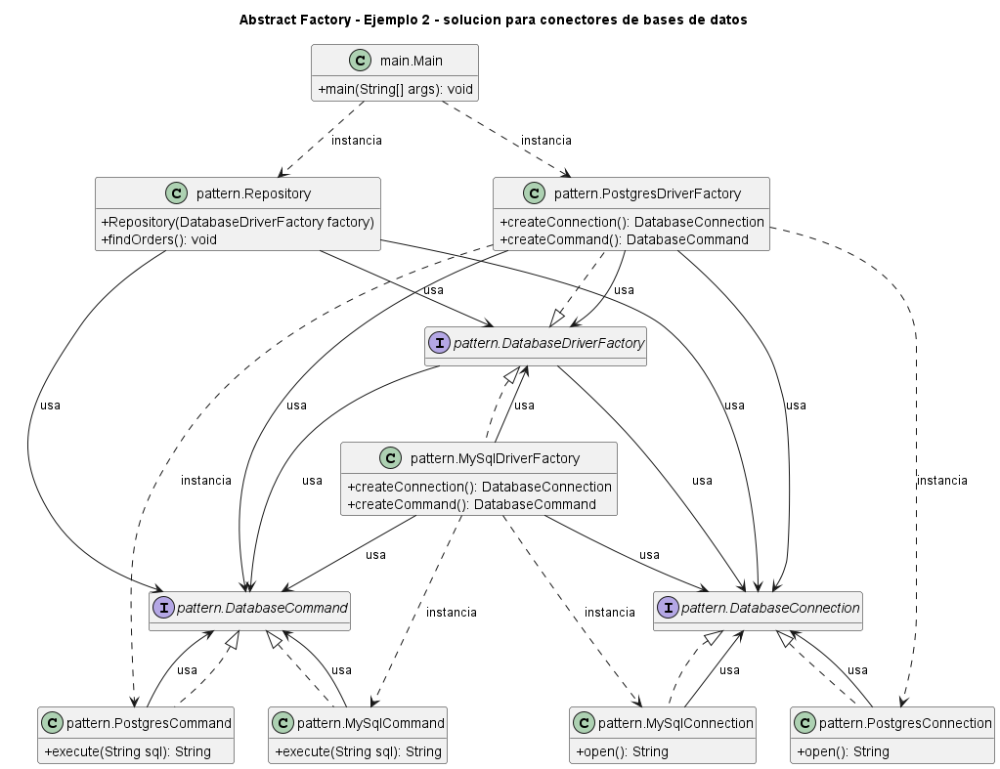

# Ejemplo: conectores de bases de datos

## Patron aplicado

Abstract Factory

## Problematica

Cada motor requiere objetos compatibles: conexion, comandos y dialecto. Mezclar piezas de motores distintos produce errores de ejecucion.

## Como la atiende el patron

La fabrica de cada motor crea una familia completa de objetos compatibles, y el repositorio depende solo de abstracciones.

## Organizacion del proyecto

- `src/main`: contiene el punto de entrada del sistema.
- `src/pattern`: contiene las clases que implementan el patron aplicado al problema.

## Ejecutar

```bash
mkdir out
javac -encoding UTF-8 -d out src/pattern/*.java src/main/*.java
java -cp out main.Main
```

## UML de la implementacion



