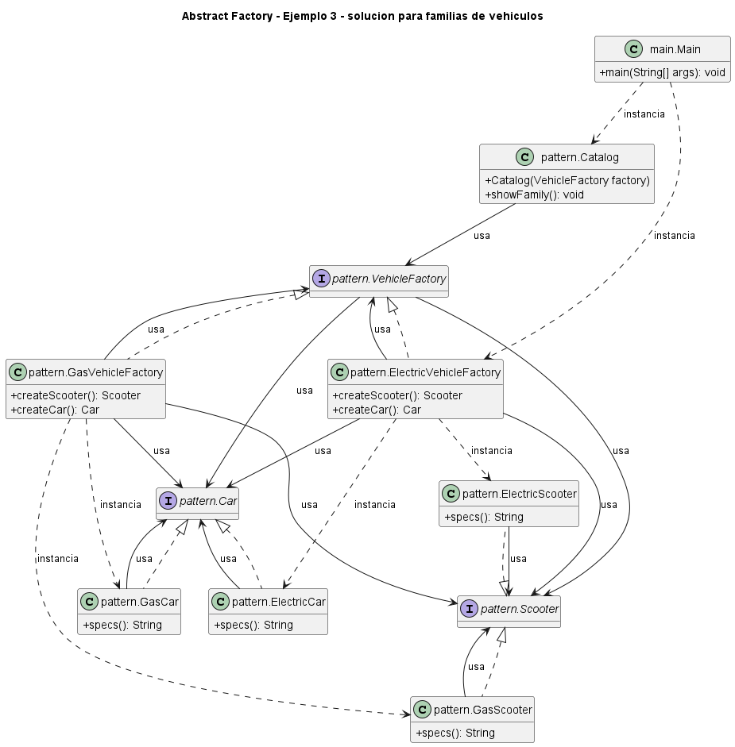

# Ejemplo: familias de vehiculos

## Patron aplicado

Abstract Factory

## Problematica

El catalogo debe mostrar vehiculos electricos o a gasolina sin conocer clases concretas ni mezclar tecnologias.

## Como la atiende el patron

Cada fabrica concreta representa una familia energetica completa y entrega scooter y auto compatibles.

## Organizacion del proyecto

- `src/main`: contiene el punto de entrada del sistema.
- `src/pattern`: contiene las clases que implementan el patron aplicado al problema.

## Ejecutar

```bash
mkdir out
javac -encoding UTF-8 -d out src/pattern/*.java src/main/*.java
java -cp out main.Main
```

## UML de la implementacion



