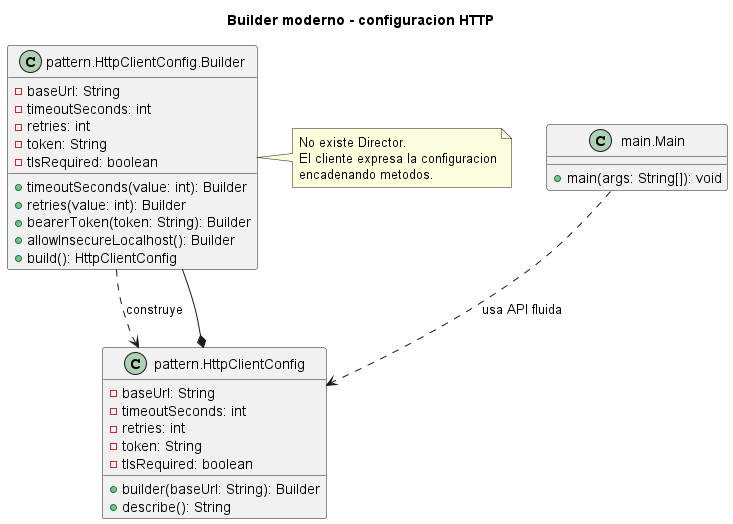

# Builder moderno sin Director para configuracion HTTP

## Patron aplicado

Builder moderno sin Director.

## Problematica

Un cliente HTTP requiere muchos parametros opcionales: URL base, timeout, reintentos, autenticacion y modo seguro. Un constructor largo seria poco legible y fragil.

## Como la atiende el patron

El builder fluido permite declarar solo las opciones relevantes y centraliza validaciones en `build()`.

## Diferencia con la version clasica con Director

En la version clasica, un `Director` conoce la secuencia de construccion y llama metodos como `buildHeader()`, `buildBody()` y `buildFooter()`. En esta version moderna, el propio `Builder` ofrece una API fluida: el cliente encadena metodos expresivos y finalmente llama a `build()`.

Esto simplifica el diseno cuando la secuencia no necesita estar encapsulada como algoritmo reutilizable. El `Director` sigue siendo util cuando hay recetas de construccion repetidas, complejas o institucionalizadas.

## Organizacion del proyecto

- `src/main`: contiene el punto de entrada del sistema.
- `src/pattern`: contiene el producto y su builder fluido.

## Ejecutar

```bash
mkdir out
javac -encoding UTF-8 -d out src/pattern/*.java src/main/*.java
java -cp out main.Main
```

## UML de la implementacion


