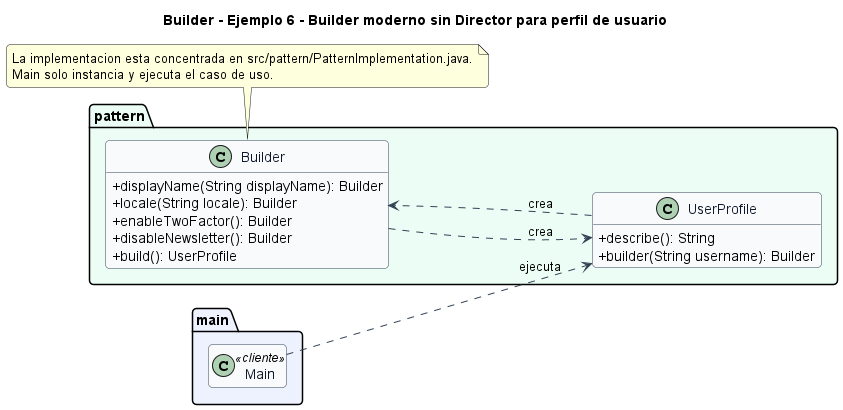

# Builder moderno sin Director para perfil de usuario

## Patron aplicado

Builder moderno sin Director.

## Problematica

Un perfil combina datos obligatorios, preferencias opcionales y banderas de seguridad. El constructor tradicional queda cargado de valores nulos o booleanos poco expresivos.

## Como la atiende el patron

El builder usa metodos con nombres semanticos, valores por defecto y una validacion final para construir un perfil consistente.

## Diferencia con la version clasica con Director

En la version clasica, un `Director` conoce la secuencia de construccion y llama metodos como `buildHeader()`, `buildBody()` y `buildFooter()`. En esta version moderna, el propio `Builder` ofrece una API fluida: el cliente encadena metodos expresivos y finalmente llama a `build()`.

Esto simplifica el diseno cuando la secuencia no necesita estar encapsulada como algoritmo reutilizable. El `Director` sigue siendo util cuando hay recetas de construccion repetidas, complejas o institucionalizadas.

## Organizacion del proyecto

- `src/main`: contiene el punto de entrada del sistema.
- `src/pattern/PatternImplementation.java`: contiene el producto y su builder fluido en un solo archivo.

## Ejecutar

```bash
mkdir out
javac -encoding UTF-8 -d out src/pattern/*.java src/main/*.java
java -cp out main.Main
```

## UML de la implementacion


