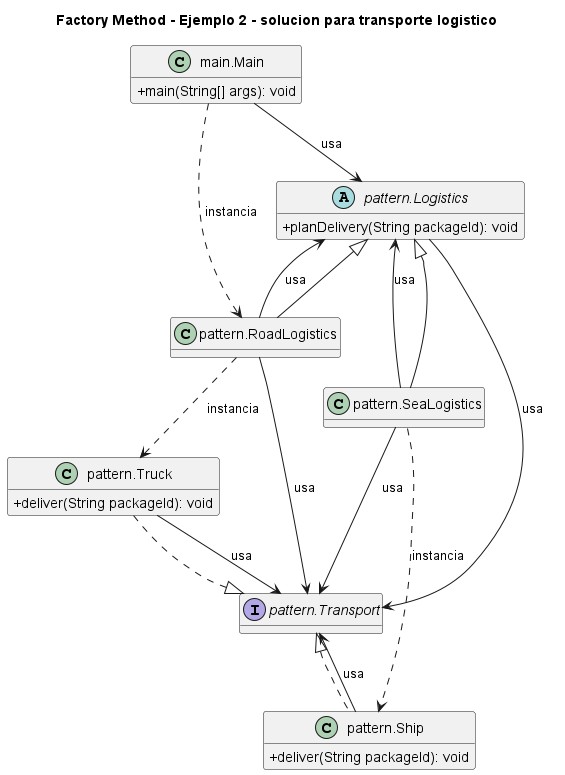

# Ejemplo: transporte logistico

## Patron aplicado

Factory Method

## Problematica

El flujo de planificacion es estable, pero el transporte concreto depende del tipo de logistica.

## Como la atiende el patron

La clase base conserva el algoritmo y cada subclase crea el transporte que corresponde.

## Organizacion del proyecto

- `src/main`: contiene el punto de entrada del sistema.
- `src/pattern`: contiene las clases que implementan el patron aplicado al problema.

## Ejecutar

```bash
mkdir out
javac -encoding UTF-8 -d out src/pattern/*.java src/main/*.java
java -cp out main.Main
```

## UML de la implementacion



