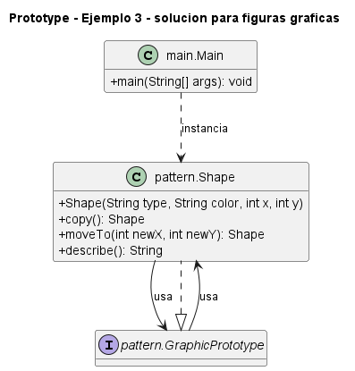

# Ejemplo: figuras graficas

## Patron aplicado

Prototype

## Problematica

Duplicar una figura debe preservar tipo y estilo, pero permitir mover la copia.

## Como la atiende el patron

La figura se clona a si misma y luego se crea una variante con nueva posicion.

## Organizacion del proyecto

- `src/main`: contiene el punto de entrada del sistema.
- `src/pattern`: contiene las clases que implementan el patron aplicado al problema.

## Ejecutar

```bash
mkdir out
javac -encoding UTF-8 -d out src/pattern/*.java src/main/*.java
java -cp out main.Main
```

## UML de la implementacion



