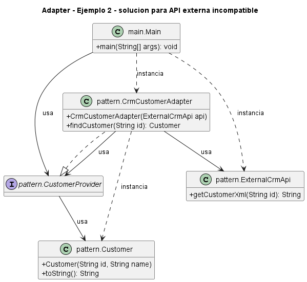

# Ejemplo: API externa incompatible

## Patron aplicado

Adapter

## Problematica

El CRM externo entrega XML, pero el sistema interno espera objetos `Customer`.

## Como la atiende el patron

El adaptador consume la API externa, traduce su formato y expone el contrato local.

## Organizacion del proyecto

- `src/main`: contiene el punto de entrada del sistema.
- `src/pattern`: contiene las clases que implementan el patron aplicado al problema.

## Ejecutar

```bash
mkdir out
javac -encoding UTF-8 -d out src/pattern/*.java src/main/*.java
java -cp out main.Main
```

## UML de la implementacion



