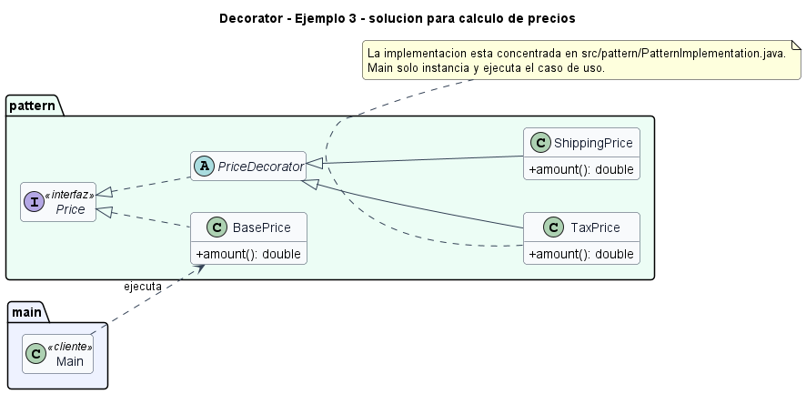

# Ejemplo: calculo de precios

## Patron aplicado

Decorator

## Problematica

Impuestos y envio se combinan con el precio base sin crear subclases por combinacion.

## Como la atiende el patron

Cada regla de precio envuelve el calculo anterior y compone el total final.

## Organizacion del proyecto

- `src/main`: contiene el punto de entrada del sistema.
- `src/pattern/PatternImplementation.java`: contiene todas las clases e interfaces del patron en un solo archivo.

## Ejecutar

```bash
mkdir out
javac -encoding UTF-8 -d out src/pattern/*.java src/main/*.java
java -cp out main.Main
```

## UML de la implementacion


