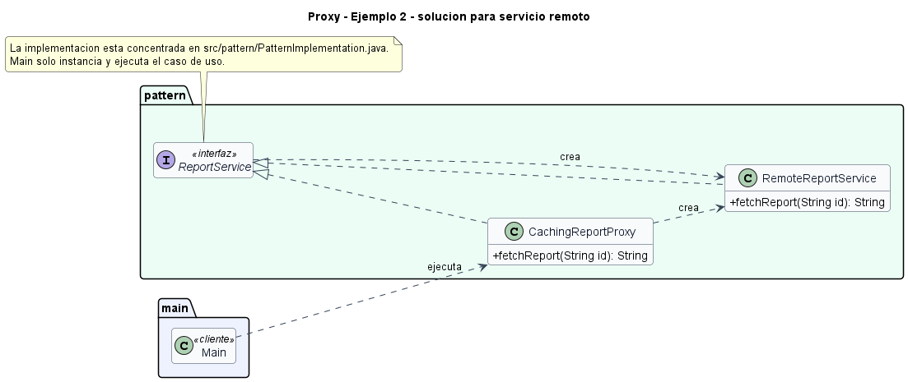

# Ejemplo: servicio remoto

## Patron aplicado

Proxy

## Problematica

Consultar reportes remotos es costoso y conviene cachear resultados.

## Como la atiende el patron

El proxy conserva la misma interfaz del servicio y agrega cache transparente.

## Organizacion del proyecto

- `src/main`: contiene el punto de entrada del sistema.
- `src/pattern/PatternImplementation.java`: contiene todas las clases e interfaces del patron en un solo archivo.

## Ejecutar

```bash
mkdir out
javac -encoding UTF-8 -d out src/pattern/*.java src/main/*.java
java -cp out main.Main
```

## UML de la implementacion


