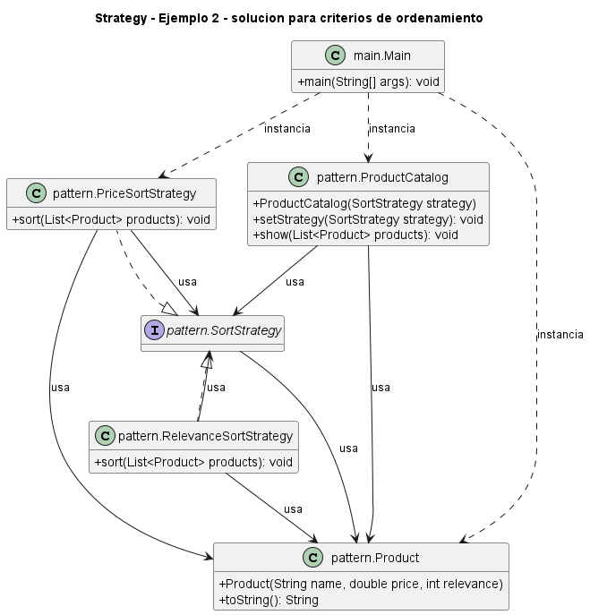

# Ejemplo: criterios de ordenamiento

## Patron aplicado

Strategy

## Problematica

El usuario puede ordenar productos por precio o relevancia sin cambiar el catalogo.

## Como la atiende el patron

Cada criterio es una estrategia intercambiable usada por el contexto.

## Organizacion del proyecto

- `src/main`: contiene el punto de entrada del sistema.
- `src/pattern`: contiene las clases que implementan el patron aplicado al problema.

## Ejecutar

```bash
mkdir out
javac -encoding UTF-8 -d out src/pattern/*.java src/main/*.java
java -cp out main.Main
```

## UML de la implementacion



