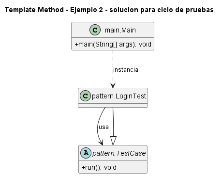

# Ejemplo: ciclo de pruebas

## Patron aplicado

Template Method

## Problematica

Las pruebas comparten preparacion, ejecucion, verificacion y limpieza.

## Como la atiende el patron

La clase base fija el ciclo y la subclase implementa pasos concretos.

## Organizacion del proyecto

- `src/main`: contiene el punto de entrada del sistema.
- `src/pattern`: contiene las clases que implementan el patron aplicado al problema.

## Ejecutar

```bash
mkdir out
javac -encoding UTF-8 -d out src/pattern/*.java src/main/*.java
java -cp out main.Main
```

## UML de la implementacion



