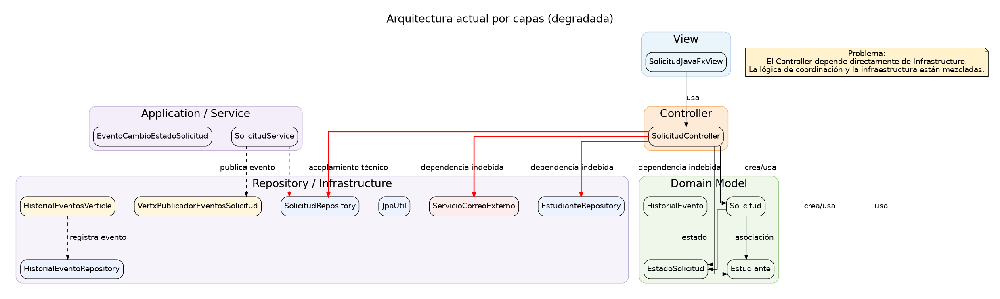
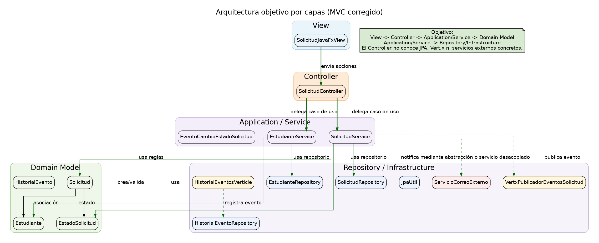
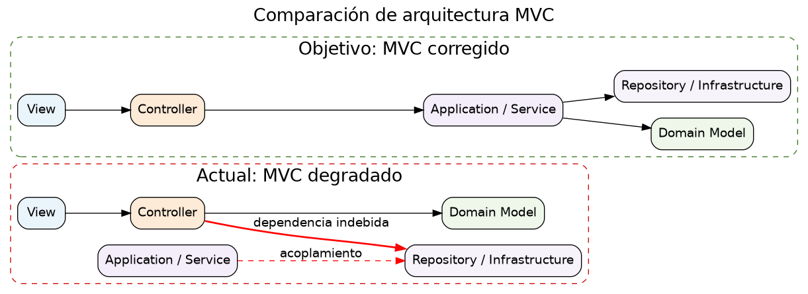

# Evaluación formativa: PSP II-2026

## 1. Contexto del sistema

Este proyecto corresponde a un sistema Java para la gestión de solicitudes académicas de estudiantes.

La aplicación permite registrar, desde una interfaz gráfica simple, los datos de un estudiante y una solicitud académica 
asociada. La interfaz permite ingresar:

- nombre del estudiante;
- correo institucional;
- tipo de solicitud;
- descripción de la solicitud;
- nuevo estado de la solicitud.

Al presionar el botón de registro, el sistema crea el estudiante, registra la solicitud, cambia su estado y muestra el
resultado de la operación en la ventana.

El sistema fue construido originalmente siguiendo una arquitectura cercana a **MVC**:

```text
View -> Controller -> Model
```

En este proyecto:

- la **View** está representada por la interfaz JavaFX;
- el **Controller** recibe las acciones de la vista;
- el **Model** está compuesto por las entidades del dominio, las reglas de negocio y la persistencia de datos.

Sin embargo, aunque el sistema todavía conserva un comportamiento visual tipo MVC, su arquitectura interna se degradó. El controlador comenzó a conocer detalles técnicos que no deberían pertenecerle, como repositorios JPA concretos y servicios externos.

Por eso, el objetivo de esta evaluación no es construir un sistema desde cero, sino **mantener, mejorar y refactorizar un sistema existente**.

---

## 2. Problemática arquitectural

El sistema actual funciona parcialmente, pero presenta deuda técnica arquitectural.

La principal degradación es que el controlador depende directamente de clases de infraestructura. Esto rompe la separación
esperada en una arquitectura MVC mantenible.

### Arquitectura actual degradada

En la arquitectura actual, el flujo visible parece MVC:

```text
View -> Controller -> Model
```

pero internamente el controlador accede directamente a infraestructura:

```text
Controller -> infra.jpa
Controller -> infra.external
```

Esto produce acoplamiento fuerte entre la capa de presentación/control y los detalles técnicos de persistencia y 
servicios externos.



### Arquitectura planeada

La arquitectura esperada debe conservar el comportamiento MVC, pero separando responsabilidades de forma más clara.

Una posible organización es:

```text
View -> Controller -> Application/Service -> Domain Model -> Repository / Infrastructure
```

En esta organización:

- la vista solo se comunica con el controlador;
- el controlador coordina la interacción con los servicios de aplicación;
- los servicios de aplicación contienen los casos de uso;
- las reglas principales se mantienen en el dominio;
- la infraestructura implementa persistencia, mensajería y servicios externos;
- las dependencias técnicas concretas no deben llegar directamente al controlador.



La comparación general entre ambas arquitecturas es la siguiente:



---

## 3. Tareas que debe realizar el estudiante

La evaluación está organizada en cuatro grupos de tareas.

---

## 3.1. Nivel arquitectural

Debe refactorizar el sistema para recuperar una arquitectura MVC más limpia y mantenible.

### Tareas esperadas

1. Identificar por qué el test arquitectural falla.
2. Revisar las dependencias actuales del controlador.
3. Evitar que el controlador dependa directamente de clases ubicadas en `infra`.
4. Mover la lógica de coordinación de casos de uso hacia una capa de aplicación.
5. Mantener las entidades y reglas básicas en el dominio.
6. Mantener la infraestructura JPA separada de la vista y del controlador.

### Test arquitectural adicional sugerido

Además del test que verifica que el controlador no dependa de infraestructura, el estudiante debe implementar al menos una regla arquitectural nueva. Algunos ejemplos relevantes son:

```text
La vista no debe depender de JPA.
El dominio no debe depender de controller, view ni infra.
Los servicios de aplicación no deben depender de JavaFX.
Las clases de infra.jpa no deben depender de view.
```

El estudiante debe escoger una regla que tenga sentido con la arquitectura final que proponga.

### Orientación

Al ejecutar los tests, el test arquitectural entrega información sobre qué dependencia está rompiendo la arquitectura. Esa información debe usarse como guía para decidir qué clases deben moverse, qué dependencias deben invertirse o qué interfaces deben introducirse.

Una solución esperada puede usar interfaces o puertos para desacoplar la aplicación de la infraestructura. No se exige una única estructura, pero la solución final debe conservar una separación clara entre:

```text
view
controller
application
domain
infra
```

---

## 3.2. Nivel de tests unitarios y cobertura

Debe crear pruebas unitarias con JUnit 4 para cubrir las reglas principales del sistema.

La cobertura mínima esperada es de 80% de líneas, verificada con JaCoCo.

### Tests mínimos sugeridos

Para alcanzar una cobertura razonable, se recomienda probar al menos:

1. Creación válida de estudiante.
2. Rechazo de estudiante con nombre vacío.
3. Rechazo de estudiante con correo vacío.
4. Creación válida de solicitud.
5. Rechazo de solicitud con estudiante nulo.
6. Rechazo de solicitud con tipo vacío.
7. Rechazo de solicitud con descripción vacía.
8. Estado inicial de una solicitud nueva.
9. Cambio válido de estado.
10. Rechazo de cambio de estado cuando la solicitud ya está finalizada.
11. Rechazo de cambio de estado con estado nulo.
12. Caso de uso de cambio de estado desde la capa de aplicación.
13. Caso de solicitud inexistente.
14. Verificación de publicación de evento al cambiar estado.
15. Verificación de notificación externa al cambiar estado.

No es necesario probar detalles internos de Hibernate. Las pruebas deben concentrarse en reglas de negocio, casos de uso
y comportamiento observable del sistema.

---

## 3.3. Test con Mockito

El sistema contiene un servicio externo simulado para notificación.

Ese servicio representa una dependencia externa. En una prueba unitaria no debe llamarse directamente, porque:

- hace que la prueba dependa de una implementación concreta;
- mezcla lógica de negocio con efectos externos;
- dificulta verificar el comportamiento del caso de uso de forma aislada.

### Tarea esperada

Debe crear o completar tests usando Mockito para verificar que, al cambiar correctamente el estado de una solicitud:

1. se guarda la solicitud actualizada;
2. se publica un evento interno;
3. se invoca el servicio externo de notificación;
4. no se invoca el servicio externo cuando la operación falla.

### Estructura sugerida del test

El test debería seguir una estructura de este tipo:

```text
Arrange:
    crear solicitud válida
    preparar repositorio mock
    preparar publicador de eventos mock
    preparar notificador externo mock

Act:
    ejecutar el caso de uso

Assert:
    verificar cambio de estado
    verificar repository.guardar(...)
    verificar publicador.publicar(...)
    verificar notificador.enviarCorreo(...)
```

El objetivo no es probar el servicio externo real, sino verificar que el caso de uso interactúa correctamente con su dependencia.

---

## 3.4. Vert.x y arquitectura orientada a mensajes

El sistema debe conservar o mejorar una parte orientada a mensajes usando Vert.x.

El cambio de estado de una solicitud debe generar un evento interno. Otro componente debe recibir ese evento y dejar 
evidencia verificable de recepción.

### Estilo de arquitectura a implementar

Para esta formativa se recomienda usar un estilo **publish-subscribe**.

La razón es que el cambio de estado de una solicitud es un evento del dominio o de aplicación. El componente que cambia 
el estado no debería necesitar conocer exactamente cuántos receptores existen ni qué hará cada uno de ellos.

El flujo esperado es:

```text
SolicitudService
      |
      | publica evento
      v
Event Bus Vert.x
      |
      | entrega evento
      v
Receptor de historial / notificación / auditoría
```

Este estilo es adecuado porque:

- desacopla al emisor de los receptores;
- permite agregar nuevos consumidores sin modificar el caso de uso principal;
- representa naturalmente eventos como “la solicitud cambió de estado”;
- permite registrar historial, auditoría o futuras notificaciones internas.

### Tareas esperadas

1. Mantener o refactorizar la publicación de eventos con Vert.x.
2. Evitar que la lógica de negocio dependa directamente de detalles de Vert.x.
3. Verificar que el evento se publica cuando el cambio de estado es válido.
4. Verificar que el receptor deja evidencia de recepción.
5. Evitar publicar eventos cuando la operación de cambio de estado falla.

No se espera una implementación compleja de mensajería distribuida. El objetivo es mostrar separación de responsabilidades mediante comunicación orientada a mensajes.

---

## 4. Cómo ejecutar el programa

Desde la carpeta raíz del proyecto, donde se encuentra el archivo `pom.xml`, ejecutar:

```bash
mvn clean compile exec:java
```

Debe abrirse una ventana JavaFX titulada:

```text
Solicitudes académicas - MVC degradado
```

Desde esa ventana se puede registrar una solicitud académica.

La base de datos SQLite se crea automáticamente en:

```text
target/solicitudes.sqlite
```

Si se desea limpiar la base de datos antes de una nueva ejecución:

```bash
rm -f target/solicitudes.sqlite
```

---

## 5. Cómo ejecutar los tests

Para ejecutar los tests:

```bash
mvn test
```

En el proyecto base, este comando debe fallar inicialmente por la prueba arquitectural. Ese fallo es intencional y 
forma parte de la evaluación.

Para ejecutar tests y verificar cobertura:

```bash
mvn verify
```

El proyecto está configurado para exigir una cobertura mínima de 80% de líneas.

---

## 6. Pasos sugeridos para resolver la formativa

Los siguientes pasos orientan la resolución, pero no constituyen una implementación detallada.

### Paso 1: Ejecutar la aplicación

Ejecutar:

```bash
mvn clean compile exec:java
```

Observar que la aplicación tiene una interfaz gráfica y un flujo visible tipo MVC.

### Paso 2: Ejecutar los tests

Ejecutar:

```bash
mvn test
```

Observar el fallo del test arquitectural. El mensaje del test indica qué dependencia rompe la arquitectura.

### Paso 3: Analizar la clase problemática

Revisar principalmente:

```text
src/main/java/cl/ucn/solicitudes/controller/SolicitudController.java
```

Identificar qué dependencias no deberían estar en el controlador.

### Paso 4: Refactorizar la arquitectura

Separar responsabilidades para que el controlador no conozca detalles de infraestructura.

Una posible dirección es:

```text
Controller -> Application Service -> Interfaces / Ports <- Infrastructure
```

La refactorización debe conservar el comportamiento visible de la aplicación.

### Paso 5: Agregar o ajustar tests unitarios

Crear tests JUnit 4 para cubrir reglas de negocio y casos de uso.

Priorizar:

- entidades del dominio;
- reglas de cambio de estado;
- casos de error;
- interacción con repositorios y servicios mediante dobles de prueba.

### Paso 6: Agregar tests con Mockito

Mockear el servicio externo y otras dependencias necesarias.

Verificar tanto los casos exitosos como los casos donde no debe invocarse la dependencia externa.

### Paso 7: Revisar Vert.x

Mantener una comunicación orientada a eventos usando publish-subscribe.

Verificar que el cambio de estado válido genera un evento y que existe evidencia de recepción.

### Paso 8: Agregar un test arquitectural propio

Implementar una regla ArchUnit adicional que sea coherente con la solución propuesta.

Por ejemplo:

```text
Las clases de view no deben depender de infra.jpa.
```

o:

```text
Las clases de application no deben depender de JavaFX.
```

### Paso 9: Verificar cobertura

Ejecutar:

```bash
mvn verify
```

Revisar el reporte de JaCoCo si no se alcanza el 80%.

El reporte queda normalmente en:

```text
target/site/jacoco/index.html
```

### Paso 10: Documentar decisiones

Actualizar este README explicando brevemente:

- qué problema arquitectural se detectó;
- qué refactorización se realizó;
- qué tests se agregaron;
- cómo se validó la cobertura;
- cómo se mantuvo o mejoró la mensajería con Vert.x.

---

## 7. Resultado esperado

Al finalizar, el proyecto debe:

- ejecutar la interfaz gráfica;
- conservar el comportamiento funcional básico;
- pasar los tests unitarios;
- pasar los tests arquitecturales;
- alcanzar al menos 80% de cobertura;
- mantener persistencia con SQLite y JPA;
- mockear correctamente el servicio externo;
- usar Vert.x para comunicación orientada a mensajes;
- presentar una arquitectura MVC más limpia y justificable.
