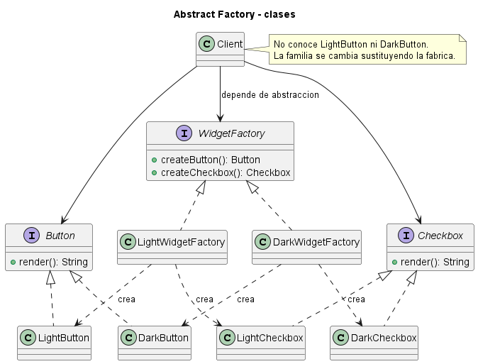
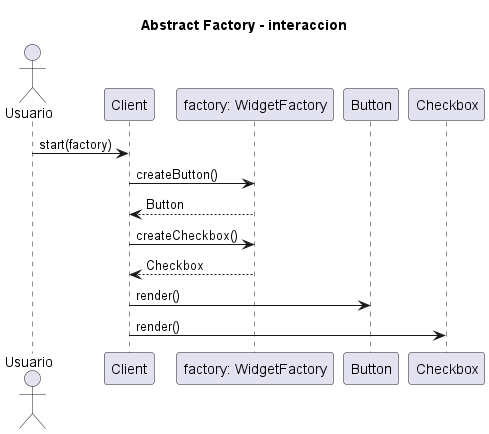
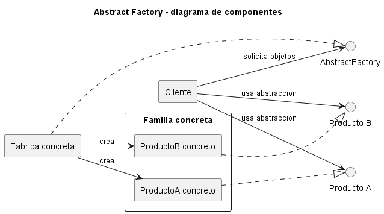

# Explicación Detallada - Abstract Factory

## Para qué sirve

Abstract Factory encapsula la creación de **familias de objetos relacionados** sin obligar al cliente a conocer sus clases concretas. Su unidad de variación no es un objeto aislado, sino una familia completa que debe mantenerse compatible: botones y ventanas de un mismo sistema visual, conectores y comandos de un mismo motor de base de datos, o vehículos y repuestos de una misma línea.

El problema central aparece cuando el cliente contiene múltiples expresiones `new` y decisiones condicionales para escoger implementaciones. Esa lógica mezcla la política de configuración con el uso de los objetos y permite combinaciones inválidas. Abstract Factory concentra esa decisión en una interfaz de fábrica.

## Cómo se usa

La estructura clásica contiene:

- **AbstractFactory**: declara una operación de creación por cada tipo de producto.
- **ConcreteFactory**: construye una variante coherente de toda la familia.
- **AbstractProduct**: define el contrato común de cada clase de producto.
- **ConcreteProduct**: implementa un producto para una familia específica.
- **Client**: depende únicamente de las fábricas y productos abstractos.

El flujo habitual es:

1. La composición de la aplicación selecciona una fábrica concreta.
2. El cliente recibe esa fábrica por constructor o parámetro.
3. El cliente solicita los productos que necesita.
4. La fábrica devuelve implementaciones pertenecientes a la misma familia.
5. El cliente usa los contratos abstractos y desconoce las clases concretas.

La selección debe ocurrir cerca del punto de arranque. Si cada clase vuelve a decidir qué fábrica utilizar, se pierde el desacoplamiento buscado.

## Por qué se usa

Se usa para proteger dos propiedades:

- **Independencia de construcción**: el cliente no cambia cuando cambia la familia concreta.
- **Consistencia entre productos**: todos los objetos creados pertenecen a una configuración compatible.

También hace explícita una decisión que, de otro modo, quedaría dispersa en condicionales. Esto facilita pruebas: una fábrica de prueba puede suministrar implementaciones controladas.

## Contextos de aplicación

Resulta apropiado en interfaces multiplataforma, controladores para distintos proveedores, kits de serialización, infraestructura intercambiable y productos configurables por mercado o ambiente.

No conviene cuando existe un solo producto, cuando las familias cambian constantemente en cantidad de tipos, o cuando una construcción directa es suficientemente clara. Agregar un nuevo producto abstracto exige modificar todas las fábricas, por lo que el patrón favorece familias estables y variantes frecuentes.

## Ventajas y desventajas

### Ventajas

- Elimina dependencias directas hacia productos concretos.
- Garantiza familias compatibles por construcción.
- Centraliza el cambio entre configuraciones.
- Favorece pruebas y sustitución de infraestructura.

### Desventajas

- Aumenta el número de interfaces y clases.
- Agregar un nuevo tipo de producto afecta a todas las fábricas.
- Puede ocultar una configuración sencilla detrás de demasiada abstracción.
- Una fábrica mal delimitada puede transformarse en un catálogo sin cohesión.

## Origen y evolución

El patrón fue sistematizado en 1994 por Gamma, Helm, Johnson y Vlissides en *Design Patterns: Elements of Reusable Object-Oriented Software*. Surge de la experiencia con frameworks orientados a objetos que necesitaban crear conjuntos compatibles sin fijar implementaciones.

Con la evolución de los lenguajes, las fábricas concretas pasaron de clases explícitas a funciones, lambdas, módulos de configuración o contenedores de inyección de dependencias. La forma puede simplificarse, pero la decisión arquitectónica permanece: seleccionar una familia coherente detrás de contratos estables.

## Estado actual

Abstract Factory sigue vigente en bibliotecas, SDK y composición de aplicaciones. En sistemas modernos suele convivir con inyección de dependencias: el contenedor selecciona la fábrica o registra directamente una familia. No debe confundirse la herramienta con el patrón; un contenedor no garantiza por sí mismo la compatibilidad semántica de los productos.

## Patrones relacionados

- **Factory Method** delega la creación de un producto mediante herencia o un método redefinible.
- **Builder** construye gradualmente un objeto complejo.
- **Prototype** crea objetos por copia.
- **Singleton** puede controlar una instancia de fábrica, aunque esa combinación introduce estado global y no es obligatoria.

## Diagramas

Los siguientes diagramas complementan la explicación conceptual. Se muestran directamente aquí para comparar estructura estática, flujo de interacción y organización de componentes.

### Diagrama de clases

El diagrama de clases muestra las abstracciones principales, sus relaciones y la dirección de dependencia estática. El DSL PlantUML está en [fig/ClassDiagram.md](fig/ClassDiagram.md).

### Diagrama de secuencia

El diagrama de secuencia muestra una ejecución típica del patrón de diseño, enfatizando el orden de mensajes entre participantes. El DSL PlantUML está en [fig/SequenceDiagrama.md](fig/SequenceDiagrama.md).

### Diagrama de componentes

El diagrama de componentes resume la colaboración estructural de mayor nivel. El DSL PlantUML está en [fig/ComponentDiagram.md](fig/ComponentDiagram.md).

## Material de esta carpeta

El [README](README.md) resume participantes y ejemplos. Los diagramas `UML.puml` y las carpetas `Ejemplo ...` permiten contrastar la estructura genérica con casos de conectores y familias de vehículos.

## Referencia principal

Gamma, E., Helm, R., Johnson, R. y Vlissides, J. (1994). *Design Patterns: Elements of Reusable Object-Oriented Software*. Addison-Wesley.
