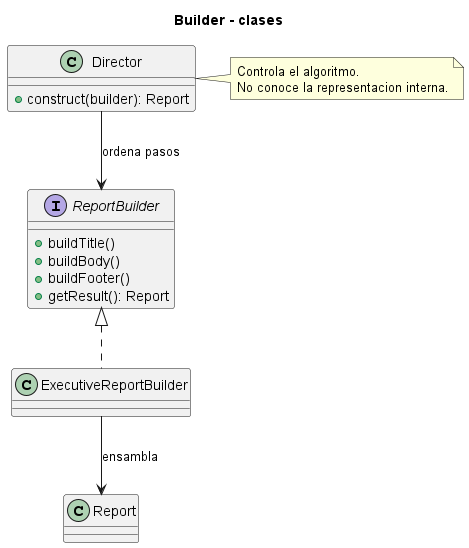
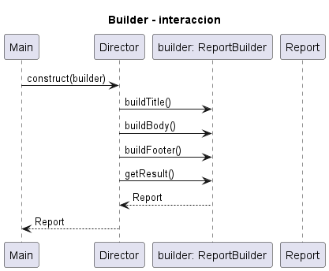
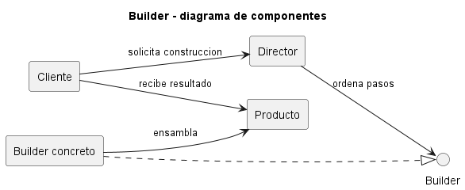

# Explicación Detallada - Builder

## Para qué sirve

Builder separa la **construcción gradual** de un objeto complejo de su representación final. Es útil cuando un objeto requiere muchos datos, tiene parámetros opcionales, debe respetar invariantes o puede construirse mediante distintas secuencias.

Su propósito no es reemplazar cualquier constructor. Resuelve el problema de constructores telescópicos, parámetros difíciles de distinguir y objetos que podrían quedar en estados intermedios inválidos.

## Cómo se usa

En la variante clásica participan:

- **Product**: objeto resultante.
- **Builder**: contrato de operaciones de construcción.
- **ConcreteBuilder**: acumula el estado y produce una representación.
- **Director**: aplica una secuencia de pasos reutilizable.

En Java moderno es frecuente una variante sin `Director`: el propio cliente encadena métodos descriptivos y termina con `build()`.

```java
Configuracion configuracion = Configuracion.builder()
    .host("localhost")
    .puerto(8080)
    .seguro(true)
    .build();
```

Un Builder correcto valida en `build()` las invariantes que dependen de varios campos. El producto debería ser inmutable cuando el dominio lo permita. El Builder puede ser mutable porque existe solo durante la construcción.

## Por qué se usa

El patrón mejora la legibilidad al reemplazar posiciones por nombres y permite que la construcción evolucione sin multiplicar constructores. También concentra valores por defecto, normalización y validación.

Debe existir una razón de complejidad real. Para una clase con dos atributos obligatorios, un constructor directo comunica mejor el diseño.

## Contextos de aplicación

Es común en solicitudes HTTP, consultas, objetos de configuración, documentos compuestos, datos de prueba y entidades con muchos campos opcionales. El `StringBuilder` de Java ilustra la idea de construcción incremental, aunque no reproduce necesariamente todos los participantes GoF.

## Ventajas y desventajas

### Ventajas

- Hace explícitos los parámetros mediante nombres.
- Permite productos inmutables con construcción flexible.
- Centraliza validaciones y valores predeterminados.
- Admite recetas de construcción reutilizables.
- Evita numerosos constructores sobrecargados.

### Desventajas

- Duplica atributos entre producto y Builder.
- Aumenta código y mantenimiento.
- Puede postergar errores hasta la llamada a `build()`.
- Un Builder que expone cualquier combinación no protege las invariantes.

## Origen y evolución

Builder fue descrito por el catálogo GoF de 1994 con énfasis en separar un algoritmo de construcción de sus representaciones. El ejemplo clásico utilizaba un `Director` para ejecutar la misma secuencia sobre distintos constructores.

Con la popularización de objetos inmutables y API fluidas, evolucionó hacia Builders anidados con métodos encadenables. Herramientas de generación de código reducen el trabajo mecánico, pero no reemplazan el diseño de invariantes. También existen **step builders**, cuyas interfaces restringen el orden y obligan a proporcionar datos requeridos antes de compilar.

## Estado actual

Builder sigue siendo frecuente en Java, especialmente en API públicas. Su uso actual valora más la inmutabilidad, la compatibilidad evolutiva y la claridad que la presencia literal de todos los roles originales. Un Builder moderno puede ser una clase estática interna y no necesitar un Director.

Debe evitarse convertirlo en un contenedor de asignaciones sin reglas. La construcción debe producir un objeto válido o fallar de manera clara.

## Patrones relacionados

- **Abstract Factory** crea familias de objetos completos.
- **Factory Method** decide qué clase concreta instanciar.
- **Prototype** parte de una instancia existente.
- **Fluent Interface** describe el estilo de llamada encadenada, no necesariamente el patrón Builder.


## Diagramas

Los siguientes diagramas complementan la explicación conceptual. Se muestran directamente aquí para comparar estructura estática, flujo de interacción y organización de componentes.

### Diagrama de clases

El diagrama de clases muestra las abstracciones principales, sus relaciones y la dirección de dependencia estática. El DSL PlantUML está en [fig/ClassDiagram.md](fig/ClassDiagram.md).



### Diagrama de secuencia

El diagrama de secuencia muestra una ejecución típica del patrón de diseño, enfatizando el orden de mensajes entre participantes. El DSL PlantUML está en [fig/SequenceDiagrama.md](fig/SequenceDiagrama.md).



### Diagrama de componentes

El diagrama de componentes resume la colaboración estructural de mayor nivel. El DSL PlantUML está en [fig/ComponentDiagram.md](fig/ComponentDiagram.md).



## Material de esta carpeta

El [README](README.md) presenta la estructura y los ejemplos. Las implementaciones incluyen el Builder clásico y variantes modernas para consultas, configuración HTTP, órdenes de compra y perfiles.

## Referencia principal

Gamma, E., Helm, R., Johnson, R. y Vlissides, J. (1994). *Design Patterns: Elements of Reusable Object-Oriented Software*. Addison-Wesley.
