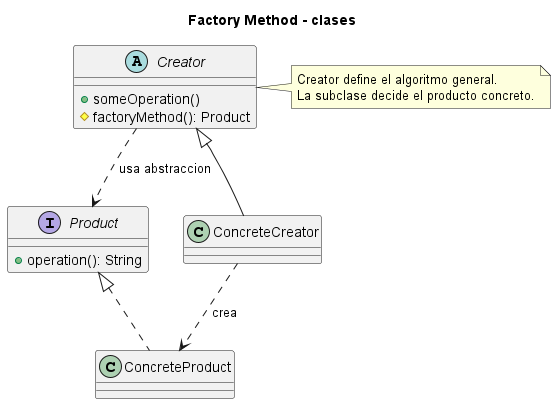
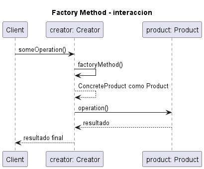
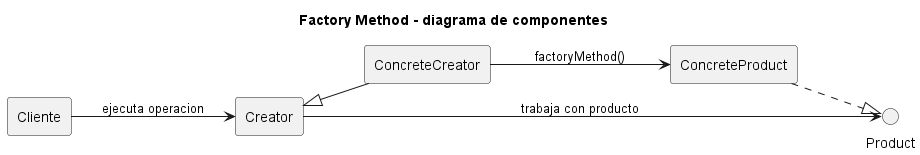

# Explicación Detallada - Factory Method

## Para qué sirve

Factory Method define una operación de creación cuyo resultado se expresa mediante un tipo abstracto, permitiendo que una subclase o implementación decida qué producto concreto entregar. La clase cliente conserva el algoritmo general, pero deja variable la construcción de una de sus colaboraciones.

El patrón es útil cuando una clase conoce **cuándo** necesita un objeto y **qué contrato** debe cumplir, pero no debería fijar su clase concreta.

## Cómo se usa

Sus participantes clásicos son:

- **Product**: interfaz del objeto creado.
- **ConcreteProduct**: implementación del producto.
- **Creator**: declara el método fábrica y contiene lógica que usa el producto.
- **ConcreteCreator**: redefine el método fábrica para escoger una implementación.

El método fábrica no debe confundirse con cualquier función estática que construye objetos. En el patrón GoF, la creación es un punto de extensión del algoritmo del `Creator`, tradicionalmente mediante polimorfismo.

El flujo es:

1. Se instancia un creador concreto.
2. El algoritmo heredado solicita un producto al método fábrica.
3. La redefinición entrega el producto adecuado.
4. El algoritmo opera sobre la interfaz `Product`.

En diseños modernos puede usarse composición, pasando un `Supplier<Product>` o una fábrica funcional. Cambia el mecanismo, pero se mantiene la inversión de la decisión de creación.

## Por qué se usa

Factory Method evita que un algoritmo reusable dependa de constructores concretos. Permite incorporar nuevos productos agregando creadores o estrategias de construcción, sin reescribir el flujo principal.

## Contextos de aplicación

Se usa en frameworks, parsers, diálogos multiplataforma, logística, creación de manejadores según protocolo y puntos de extensión de bibliotecas. Es apropiado cuando la creación cambia entre variantes y el procesamiento posterior es estable.

No es necesario si una selección local simple y cerrada se entiende mejor con un constructor o una función. Crear jerarquías solo para evitar una línea `new` no aporta valor.

## Ventajas y desventajas

### Ventajas

- Reduce el acoplamiento con clases concretas.
- Proporciona un punto de extensión controlado.
- Reutiliza el algoritmo del creador.
- Apoya el principio abierto/cerrado cuando aparecen nuevos productos.

### Desventajas

- Puede exigir una subclase adicional por variante.
- Dispersa la configuración entre una jerarquía de creadores.
- El abuso de herencia dificulta la composición.
- No resuelve por sí solo la creación de familias completas.

## Origen y evolución

El patrón fue formalizado en el catálogo GoF de 1994. Refleja una práctica temprana de frameworks orientados a objetos: el framework controla el ciclo general y llama operaciones redefinibles para que una aplicación suministre detalles.

La evolución hacia composición e inyección de dependencias redujo la necesidad de subclases. Hoy es habitual representar el método fábrica mediante una interfaz funcional o registrar proveedores en un contenedor. La idea esencial continúa siendo separar la política de creación del algoritmo consumidor.

## Estado actual

Factory Method permanece vigente, aunque muchas implementaciones modernas son más pequeñas que la estructura clásica. Debe evaluarse por la dirección de la dependencia y el punto de variación, no por la presencia exacta de nombres como `Creator`.

## Patrones relacionados

- **Abstract Factory** agrupa varios métodos de creación para familias compatibles.
- **Template Method** puede llamar a un Factory Method como paso variable.
- **Strategy** reemplaza herencia por composición para variar comportamiento.
- Una **Simple Factory** centraliza una selección, pero no constituye necesariamente el Factory Method GoF.

## Diagramas

Los siguientes diagramas complementan la explicación conceptual. Se muestran directamente aquí para comparar estructura estática, flujo de interacción y organización de componentes.

### Diagrama de clases

El diagrama de clases muestra las abstracciones principales, sus relaciones y la dirección de dependencia estática. El DSL PlantUML está en [fig/ClassDiagram.md](fig/ClassDiagram.md).

### Diagrama de secuencia

El diagrama de secuencia muestra una ejecución típica del patrón de diseño, enfatizando el orden de mensajes entre participantes. El DSL PlantUML está en [fig/SequenceDiagrama.md](fig/SequenceDiagrama.md).

### Diagrama de componentes

El diagrama de componentes resume la colaboración estructural de mayor nivel. El DSL PlantUML está en [fig/ComponentDiagram.md](fig/ComponentDiagram.md).

## Material de esta carpeta

El [README](README.md), el diagrama `UML.puml` y los ejemplos de transporte y diálogos permiten observar la separación entre el flujo estable y la creación variable.

## Referencia principal

Gamma, E., Helm, R., Johnson, R. y Vlissides, J. (1994). *Design Patterns: Elements of Reusable Object-Oriented Software*. Addison-Wesley.
