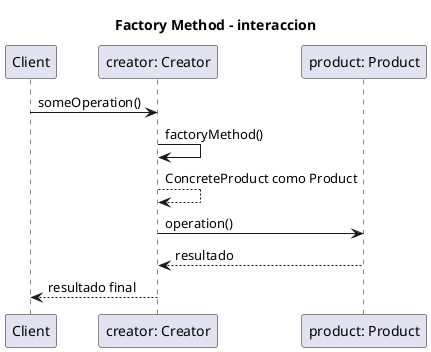

# Diagrama de secuencia - Factory Method

Este archivo conserva el DSL PlantUML utilizado para generar `SequenceDiagrama.png`. La imagen se referencia desde `EXPLICACIÓN.md` para que el material pueda estudiarse sin abrir herramientas externas.

