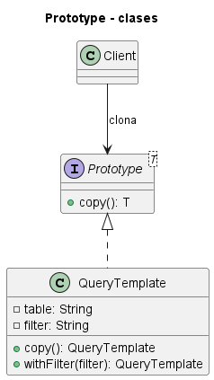
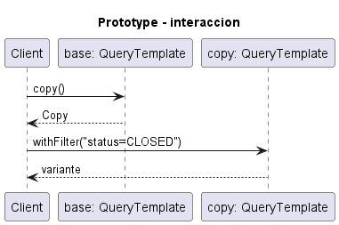

# Prototype

Consulta la [explicación detallada](EXPLICACIÓN.md) para estudiar su propósito, uso, evolución, ventajas y limitaciones.

## Proposito

Crear objetos copiando un prototipo existente en lugar de acoplar el cliente a clases concretas.

## Problema que resuelve

Construir desde cero puede ser costoso o requerir una configuracion extensa que se repite con pequenas variaciones.

## Idea de solucion

Los objetos implementan `copy()`. El cliente clona un prototipo ya configurado y modifica solo lo necesario.

## Interaccion entre clases

`Client` mantiene un `Prototype<T>`, solicita `copy()` y obtiene una nueva instancia con el mismo estado base.

El archivo `UML.puml` y los archivos de `fig/` contienen dos vistas: un diagrama de clases, que muestra la estructura estatica, y un diagrama de secuencia, que muestra el flujo de mensajes entre objetos durante una ejecucion tipica.

## Palabras clave para reconocerlo

- `clonar`
- `prototipo`
- `copia`
- `objeto configurado`
- `plantilla`
- `crear por duplicacion`

## Implementacion Java

Cada clase esta separada en un archivo para que la estructura del patron sea visible:

- `src/Client.java`
- `src/Main.java`
- `src/Prototype.java`
- `src/QueryTemplate.java`

Para compilar y ejecutar desde esta carpeta:

```bash
javac -encoding UTF-8 src/*.java
java -cp src Main
```

## Tres ejemplos de aplicacion

### Ejemplo 1: Implementacion Generica

**Problematica:** se necesita estudiar la estructura esencial del patron sin ruido accidental de un dominio especifico. **Como la atiende el patron:** muestra la estructura basica para crear objetos mediante copia de un prototipo.

### Ejemplo 2: Configuraciones de consulta

**Problematica:** una consulta base se reutiliza con filtros distintos. **Como la atiende el patron:** el prototipo se copia y se ajusta la variante.

### Ejemplo 3: Figuras graficas

**Problematica:** duplicar una figura debe preservar estilo y cambiar posicion. **Como la atiende el patron:** cada figura produce su propia copia.

## Otras situaciones donde puede usarse

- Editores graficos que duplican objetos.
- Plantillas de documentos por cliente.
- Simulaciones que clonan escenarios base.


## Diagramas UML

### Diagrama de clases



### Diagrama de secuencia


