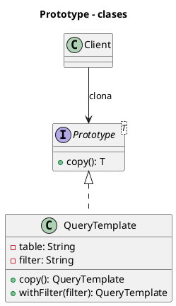

# Diagrama de clases - Prototype

Este archivo conserva el DSL PlantUML utilizado para generar `ClassDiagram.png`. La imagen se referencia desde `EXPLICACIÓN.md` para que el material pueda estudiarse sin abrir herramientas externas.

