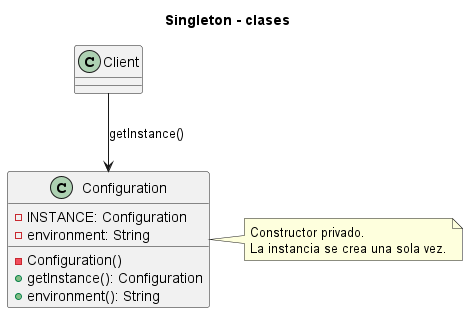
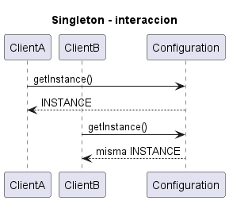

# Singleton

Consulta la [explicación detallada](EXPLICACIÓN.md) para estudiar su propósito, uso, evolución, ventajas y limitaciones.

## Proposito

Garantizar una unica instancia y ofrecer un punto de acceso controlado.

## Problema que resuelve

Un recurso compartido debe coordinarse desde un solo objeto. Multiples instancias podrian duplicar estado o producir configuraciones contradictorias.

## Idea de solucion

La clase oculta su constructor y expone `getInstance()`, que retorna siempre la misma instancia.

## Interaccion entre clases

Los clientes solicitan `Configuration.getInstance()`. La clase controla internamente la creacion y devuelve la instancia ya existente.

El archivo `UML.puml` y los archivos de `fig/` contienen dos vistas: un diagrama de clases, que muestra la estructura estatica, y un diagrama de secuencia, que muestra el flujo de mensajes entre objetos durante una ejecucion tipica.

## Palabras clave para reconocerlo

- `unica instancia`
- `getInstance`
- `constructor privado`
- `punto global`
- `recurso compartido`
- `estado global`

## Implementacion Java

Cada clase esta separada en un archivo para que la estructura del patron sea visible:

- `src/Configuration.java`
- `src/Main.java`

Para compilar y ejecutar desde esta carpeta:

```bash
javac -encoding UTF-8 src/*.java
java -cp src Main
```

## Tres ejemplos de aplicacion

### Ejemplo 1: Implementacion Generica

**Problematica:** se necesita estudiar la estructura esencial del patron sin ruido accidental de un dominio especifico. **Como la atiende el patron:** muestra la estructura basica para controlar una unica instancia compartida.

### Ejemplo 2: Auditoria centralizada

**Problematica:** los eventos deben registrarse en un flujo unico y ordenado. **Como la atiende el patron:** la instancia unica conserva la secuencia compartida.

### Ejemplo 3: Cache compartida

**Problematica:** cargar metadatos repetidamente desperdicia recursos. **Como la atiende el patron:** el singleton centraliza una cache comun.

## Otras situaciones donde puede usarse

- Coordinadores de recursos unicos.
- Registro centralizado de auditoria.
- Configuracion global inmutable.


## Diagramas UML

### Diagrama de clases



### Diagrama de secuencia


