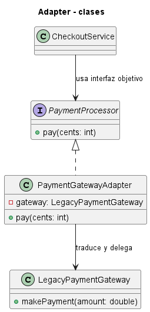
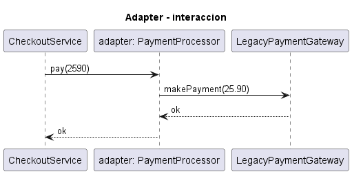
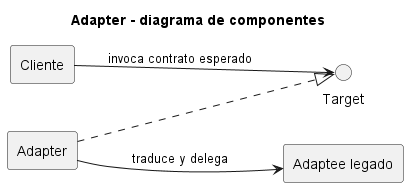

# Explicación Detallada - Adapter

## Para qué sirve

Adapter permite que un cliente use una clase cuya interfaz es incompatible con el contrato esperado. Traduce llamadas, datos o unidades entre dos modelos sin modificar necesariamente al cliente ni al componente adaptado.

El patrón aparece en límites: bibliotecas heredadas, APIs externas, dispositivos, formatos de datos y migraciones. Su objetivo es **compatibilidad**, no agregar reglas de negocio arbitrarias.

## Cómo se usa

Participan:

- **Target**: interfaz que el cliente comprende.
- **Client**: depende de `Target`.
- **Adaptee**: servicio existente con una interfaz diferente.
- **Adapter**: implementa `Target`, delega en `Adaptee` y traduce lo necesario.

Un adaptador de objeto recibe el adaptado por composición. Esta variante es flexible y permite sustituirlo en pruebas. El adaptador de clase usa herencia y depende de las posibilidades del lenguaje.

La traducción debe cubrir nombres, tipos, unidades, protocolos de error y semántica. Cambiar `getMiles()` por `getKilometros()` no es correcto si se omite la conversión de magnitudes.

## Por qué se usa

Evita contaminar el dominio con detalles de un proveedor y conserva un contrato estable para el cliente. También crea un lugar único para aislar cambios de una API externa.

## Contextos de aplicación

Se usa al integrar pasarelas de pago, clientes HTTP, sistemas heredados, bibliotecas con modelos incompatibles y persistencia externa. En diseño guiado por dominio, un adaptador puede formar parte de una capa anticorrupción.

No conviene si ambos contratos pueden unificarse directamente o si la traducción encubre una incompatibilidad conceptual profunda. En ese caso puede requerirse un modelo intermedio más explícito.

## Ventajas y desventajas

### Ventajas

- Reutiliza componentes existentes.
- Aísla dependencias externas y conversiones.
- Mantiene estable el contrato del cliente.
- Favorece sustitución y pruebas.

### Desventajas

- Agrega una capa de indirección.
- Puede perder información al convertir modelos.
- Debe mantenerse cuando cambia el proveedor.
- Un adaptador demasiado amplio se convierte en una fachada o servicio con responsabilidades mezcladas.

## Origen y evolución

Adapter fue sistematizado por GoF en 1994, aunque la traducción entre interfaces es anterior a la orientación a objetos. El catálogo distinguió adaptadores por herencia y por composición.

En arquitecturas modernas el patrón se amplió desde clases individuales hacia bordes de sistemas: adaptadores de entrada y salida, gateways, clientes y mapeadores. La arquitectura hexagonal utiliza el mismo principio a escala arquitectural, conectando puertos del núcleo con tecnologías concretas.

## Estado actual

Adapter sigue siendo fundamental en integración. Las API REST, eventos y SDK no eliminan incompatibilidades; solo cambian su forma. Hoy se espera además que el adaptador gestione tiempos de espera, errores, observabilidad y evolución de versiones sin filtrar detalles técnicos al dominio.

## Patrones relacionados

- **Facade** ofrece una interfaz simplificada; Adapter busca compatibilidad con una interfaz esperada.
- **Decorator** conserva el contrato y agrega comportamiento.
- **Proxy** conserva el contrato y controla el acceso.
- **Bridge** separa dos dimensiones de variación diseñadas desde el inicio.

## Diagramas

Los siguientes diagramas complementan la explicación conceptual. Se muestran directamente aquí para comparar estructura estática, flujo de interacción y organización de componentes.

### Diagrama de clases

El diagrama de clases muestra las abstracciones principales, sus relaciones y la dirección de dependencia estática. El DSL PlantUML está en [fig/ClassDiagram.md](fig/ClassDiagram.md).

### Diagrama de secuencia

El diagrama de secuencia muestra una ejecución típica del patrón de diseño, enfatizando el orden de mensajes entre participantes. El DSL PlantUML está en [fig/SequenceDiagrama.md](fig/SequenceDiagrama.md).

### Diagrama de componentes

El diagrama de componentes resume la colaboración estructural de mayor nivel. El DSL PlantUML está en [fig/ComponentDiagram.md](fig/ComponentDiagram.md).

## Material de esta carpeta

El [README](README.md) y los ejemplos muestran adaptación de APIs y unidades. La revisión debe comprobar tanto la firma como la equivalencia semántica de cada conversión.

## Referencia principal

Gamma, E., Helm, R., Johnson, R. y Vlissides, J. (1994). *Design Patterns: Elements of Reusable Object-Oriented Software*. Addison-Wesley.
