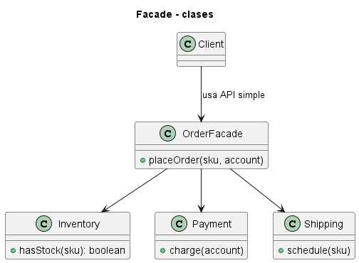
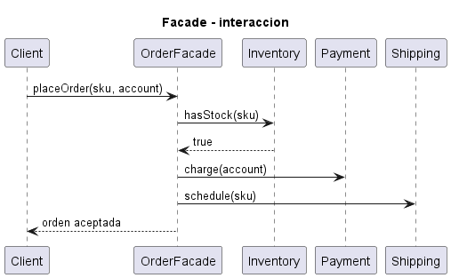
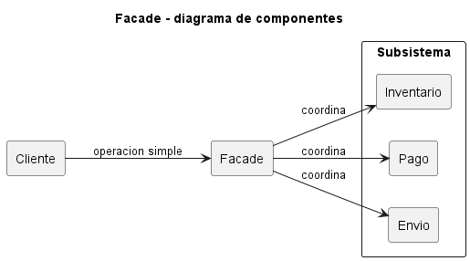

# Explicación Detallada - Facade

## Para qué sirve

Facade ofrece una interfaz de alto nivel para un subsistema complejo. Su objetivo es proporcionar un punto de entrada comprensible para los casos de uso frecuentes, coordinando varias clases internas sin exponer su secuencia al cliente.

No elimina necesariamente las interfaces del subsistema. Los clientes avanzados pueden usarlas cuando sea apropiado; la fachada define un camino simple y estable.

## Cómo se usa

Una fachada recibe o crea las colaboraciones del subsistema y publica operaciones orientadas al propósito del cliente:

```text
procesarCompra(datos)
```

Esa operación puede validar, reservar inventario, cobrar y notificar. El cliente no necesita conocer el orden ni las dependencias internas.

La fachada debe trabajar al nivel de casos de uso. Si solo replica cada método de cada clase, agrega delegación sin simplificación. Si concentra todas las reglas del sistema, se convierte en una clase dominante y destruye la cohesión del dominio.

## Por qué se usa

Reduce el conocimiento que los consumidores necesitan sobre el subsistema y disminuye el acoplamiento a su estructura interna. También establece un límite donde aplicar transacciones, autorización u observabilidad del caso de uso.

## Contextos de aplicación

Se utiliza en SDK, servicios de aplicación, módulos, bibliotecas complejas, procesos de compra, subsistemas multimedia y migraciones. Puede servir como API pública de un módulo mientras sus componentes internos evolucionan.

No conviene cuando el subsistema ya posee una interfaz pequeña o cuando distintos clientes necesitan combinaciones tan diversas que una fachada única sería artificial.

## Ventajas y desventajas

### Ventajas

- Simplifica el uso de múltiples componentes.
- Reduce dependencias entre cliente y subsistema.
- Define un límite estable.
- Centraliza secuencias de coordinación.
- Facilita evolución interna.

### Desventajas

- Puede crecer hasta convertirse en un objeto con demasiadas responsabilidades.
- Puede ocultar operaciones costosas detrás de un método aparentemente simple.
- Una fachada única puede acoplar casos de uso no relacionados.
- No garantiza aislamiento si los clientes siguen accediendo a componentes internos.

## Origen y evolución

Facade fue formalizado por GoF en 1994. Recoge la práctica de ofrecer interfaces simplificadas sobre bibliotecas y subsistemas con numerosas clases.

Su evolución arquitectural aparece en servicios de aplicación, APIs de módulo y puertas de entrada. En un monolito modular, una fachada puede ser el contrato público de cada módulo. En sistemas distribuidos, un API Gateway comparte la idea de punto de entrada, pero agrega preocupaciones de red y no es simplemente el patrón de objetos.

## Estado actual

Facade sigue siendo una herramienta efectiva para modularidad. La tendencia actual es preferir varias fachadas cohesionadas por capacidad o caso de uso antes que una fachada global. El contrato debe expresar resultados y fallos, no esconderlos.

## Patrones relacionados

- **Adapter** traduce hacia una interfaz requerida.
- **Mediator** coordina interacciones entre colegas que conocen al mediador.
- **Proxy** representa un objeto y controla su acceso.
- **Application Service** puede implementar una fachada orientada a casos de uso.


## Diagramas

Los siguientes diagramas complementan la explicación conceptual. Se muestran directamente aquí para comparar estructura estática, flujo de interacción y organización de componentes.

### Diagrama de clases

El diagrama de clases muestra las abstracciones principales, sus relaciones y la dirección de dependencia estática. El DSL PlantUML está en [fig/ClassDiagram.md](fig/ClassDiagram.md).



### Diagrama de secuencia

El diagrama de secuencia muestra una ejecución típica del patrón de diseño, enfatizando el orden de mensajes entre participantes. El DSL PlantUML está en [fig/SequenceDiagrama.md](fig/SequenceDiagrama.md).



### Diagrama de componentes

El diagrama de componentes resume la colaboración estructural de mayor nivel. El DSL PlantUML está en [fig/ComponentDiagram.md](fig/ComponentDiagram.md).



## Material de esta carpeta

El [README](README.md) y los ejemplos permiten identificar qué secuencia desaparece del cliente y qué responsabilidades permanecen en los componentes internos.

## Referencia principal

Gamma, E., Helm, R., Johnson, R. y Vlissides, J. (1994). *Design Patterns: Elements of Reusable Object-Oriented Software*. Addison-Wesley.
