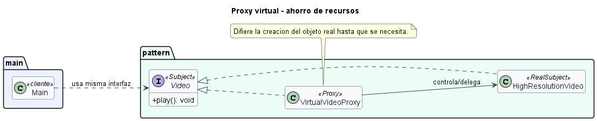

# Proxy virtual para ahorro de recursos

## Patron aplicado

Proxy.

## Tipo de proxy

Proxy virtual o de carga diferida.

## Problematica

Un catalogo puede listar muchos videos pesados. Cargarlos todos al abrir la pantalla consume memoria y tiempo aunque el usuario vea solo algunos.

## Como la atiende el patron

El proxy representa al video desde el inicio, pero crea el reproductor real solo cuando se solicita reproducirlo.

## Organizacion del proyecto

- `src/main/Main.java`: ejecuta el caso de uso.
- `src/pattern/PatternImplementation.java`: contiene la interfaz comun, el sujeto real y el proxy.

## Ejecutar

```bash
mkdir out
javac -encoding UTF-8 -d out src/pattern/*.java src/main/*.java
java -cp out main.Main
```

## UML de la implementacion


