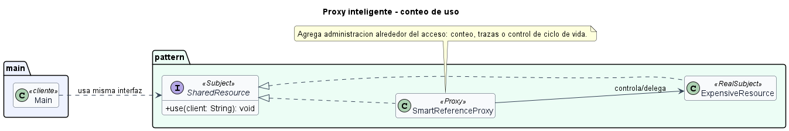

# Proxy inteligente para conteo de uso

## Patron aplicado

Proxy.

## Tipo de proxy

Proxy inteligente o smart reference.

## Problematica

Un recurso compartido debe registrar cuantas veces se usa y liberar informacion auxiliar cuando deja de ser necesario. El cliente no deberia mezclar esa administracion con la operacion principal.

## Como la atiende el patron

El proxy intercepta cada acceso, incrementa un contador y luego delega al recurso real.

## Organizacion del proyecto

- `src/main/Main.java`: ejecuta el caso de uso.
- `src/pattern/PatternImplementation.java`: contiene la interfaz comun, el sujeto real y el proxy.

## Ejecutar

```bash
mkdir out
javac -encoding UTF-8 -d out src/pattern/*.java src/main/*.java
java -cp out main.Main
```

## UML de la implementacion


