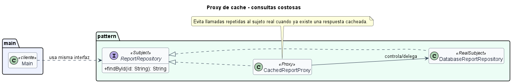

# Proxy de cache para consultas costosas

## Patron aplicado

Proxy.

## Tipo de proxy

Proxy de cache.

## Problematica

Una consulta de reportes es costosa y suele repetirse con los mismos parametros. Repetirla degrada el rendimiento.

## Como la atiende el patron

El proxy mantiene una cache transparente: si el dato ya fue consultado, responde sin invocar al servicio real.

## Organizacion del proyecto

- `src/main/Main.java`: ejecuta el caso de uso.
- `src/pattern/PatternImplementation.java`: contiene la interfaz comun, el sujeto real y el proxy.

## Ejecutar

```bash
mkdir out
javac -encoding UTF-8 -d out src/pattern/*.java src/main/*.java
java -cp out main.Main
```

## UML de la implementacion


