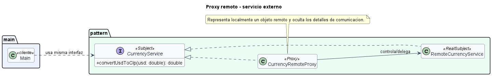

# Proxy remoto para servicio externo

## Patron aplicado

Proxy.

## Tipo de proxy

Proxy remoto.

## Problematica

El cliente quiere invocar un servicio que vive fuera del proceso. No deberia conocer detalles de red, serializacion o endpoint.

## Como la atiende el patron

El proxy implementa la misma interfaz local y encapsula la comunicacion remota simulada.

## Organizacion del proyecto

- `src/main/Main.java`: ejecuta el caso de uso.
- `src/pattern/PatternImplementation.java`: contiene la interfaz comun, el sujeto real y el proxy.

## Ejecutar

```bash
mkdir out
javac -encoding UTF-8 -d out src/pattern/*.java src/main/*.java
java -cp out main.Main
```

## UML de la implementacion


