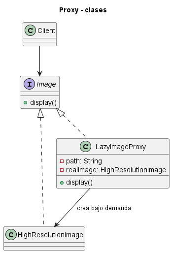
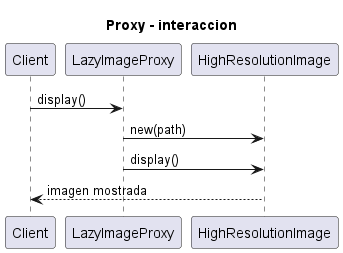

# Proxy

Consulta la [explicación detallada](EXPLICACIÓN.md) para estudiar su propósito, uso, evolución, ventajas y limitaciones.

## Proposito

Usar un sustituto con la misma interfaz que el objeto real para controlar su acceso, su costo, su seguridad, su ubicacion o su ciclo de vida.

## Problema que resuelve

El cliente necesita trabajar con un objeto, pero acceder directamente a el puede ser caro, inseguro, remoto, repetitivo o requerir administracion adicional.

## Idea de solucion

El proxy implementa la misma interfaz que el sujeto real. El cliente usa esa interfaz comun y el proxy decide si crea el objeto real, valida permisos, cachea resultados, registra accesos o encapsula una llamada remota.

## Utilidades concretas del Proxy

- **Proxy virtual o de ahorro:** retrasa la creacion de objetos costosos hasta que se necesitan.
- **Proxy de proteccion o seguridad:** valida permisos antes de delegar al sujeto real.
- **Proxy remoto:** representa localmente un objeto ubicado en otro proceso, servidor o servicio.
- **Proxy de cache:** evita repetir operaciones costosas guardando resultados.
- **Proxy inteligente:** agrega administracion adicional como conteo de referencias, logging, metricas o control de ciclo de vida.

## Ejemplos implementados

- `Ejemplo 1 - Implementacion Generica`: estructura minima del patron.
- `Ejemplo 2 - solucion para servicio remoto`: proxy con cache delante de un servicio de reportes.
- `Ejemplo 3 - solucion para documentos protegidos`: proxy de proteccion por rol.
- `Ejemplo 4 - Proxy virtual para ahorro de recursos`: carga diferida de videos pesados.
- `Ejemplo 5 - Proxy inteligente para conteo de uso`: conteo de accesos antes de delegar.
- `Ejemplo 6 - Proxy de cache para consultas costosas`: cache transparente para consultas repetidas.
- `Ejemplo 7 - Proxy remoto para servicio externo`: representacion local de un servicio externo.

## Palabras clave para reconocerlo

- `sustituto`
- `misma interfaz`
- `control de acceso`
- `carga diferida`
- `cache`
- `objeto remoto`
- `proteccion`
- `logging`
- `metricas`
- `ciclo de vida`

## Criterio academico

La senal central es que el cliente cree estar usando el sujeto real porque ambos comparten interfaz, pero en realidad interactua con un intermediario que agrega una politica de acceso. Si el intermediario no conserva la misma interfaz, probablemente se trata de Adapter, Facade u otro patron estructural, no de Proxy.

## Diagramas UML

### Diagrama de clases

### Diagrama de secuencia

