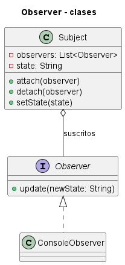
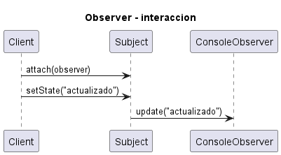

# Observer

Consulta la [explicación detallada](EXPLICACIÓN.md) para estudiar su propósito, uso, evolución, ventajas y limitaciones.

## Proposito

Notificar automaticamente a multiples observadores cuando cambia el estado de un sujeto.

## Problema que resuelve

Varios objetos deben reaccionar a cambios de otro objeto, pero el sujeto no deberia conocer sus clases concretas.

## Idea de solucion

El sujeto administra suscripciones y notifica a todos los observadores mediante una interfaz comun.

## Interaccion entre clases

`Subject.setState()` actualiza el estado y llama a `notifyObservers()`. Cada `Observer` recibe `update(newState)`.

El archivo `UML.puml` y los archivos de `fig/` contienen dos vistas: un diagrama de clases, que muestra la estructura estatica, y un diagrama de secuencia, que muestra el flujo de mensajes entre objetos durante una ejecucion tipica.

## Palabras clave para reconocerlo

- `notificar cambios`
- `suscripcion`
- `observadores`
- `evento`
- `uno a muchos`
- `actualizar vistas`

## Implementacion Java

Cada clase esta separada en un archivo para que la estructura del patron sea visible:

- `src/ConsoleObserver.java`
- `src/Main.java`
- `src/Observer.java`
- `src/Subject.java`

Para compilar y ejecutar desde esta carpeta:

```bash
javac -encoding UTF-8 src/*.java
java -cp src Main
```

## Tres ejemplos de aplicacion

### Ejemplo 1: Implementacion Generica

**Problematica:** se necesita estudiar la estructura esencial del patron sin ruido accidental de un dominio especifico. **Como la atiende el patron:** muestra la estructura basica para notificar cambios a observadores suscritos.

### Ejemplo 2: Eventos de dominio

**Problematica:** varios modulos reaccionan cuando se crea una orden. **Como la atiende el patron:** el publicador notifica a listeners desacoplados.

### Ejemplo 3: Tablero en tiempo real

**Problematica:** graficos y contadores deben actualizarse con la metrica. **Como la atiende el patron:** el dashboard notifica a widgets observadores.

## Otras situaciones donde puede usarse

- Modelo con multiples vistas.
- Eventos de dominio.
- Tableros en tiempo real.


## Diagramas UML

### Diagrama de clases



### Diagrama de secuencia


