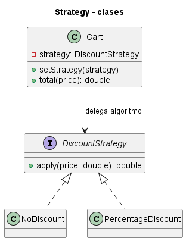
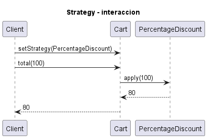
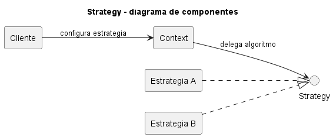

# Explicación Detallada - Strategy

## Para qué sirve

Strategy encapsula algoritmos intercambiables detrás de un contrato común. El contexto delega la operación variable a una estrategia y conserva sus demás responsabilidades.

Se utiliza cuando varias reglas resuelven el mismo tipo de problema: ordenar con criterios distintos, calcular rutas, aplicar descuentos o seleccionar políticas de validación.

## Cómo se usa

Participan:

- **Strategy**: contrato del algoritmo variable.
- **ConcreteStrategy**: implementación de una política.
- **Context**: usa una estrategia sin conocer sus detalles.
- **Cliente o fábrica**: selecciona la estrategia adecuada.

La interfaz debe representar una variación coherente. Si cada estrategia requiere parámetros totalmente distintos, el contrato probablemente está mal delimitado.

La selección puede ocurrir al construir el contexto, por operación o mediante una fábrica. Si cambia durante la ejecución, debe considerarse la seguridad frente a concurrencia y la consistencia del estado.

## Por qué se usa

Reemplaza condicionales repetidos y jerarquías de herencia por composición. Hace que cada algoritmo pueda probarse por separado y que el contexto dependa de una abstracción.

Un único `if` estable no justifica necesariamente el patrón. Strategy aporta valor cuando la variación es significativa, crece o debe configurarse.

## Contextos de aplicación

Se usa en precios, rutas, serialización, compresión, autenticación, validación y criterios de ordenamiento. Las interfaces funcionales y lambdas son una representación compacta cuando la estrategia contiene una sola operación y poco estado.

## Ventajas y desventajas

### Ventajas

- Aísla algoritmos y facilita sus pruebas.
- Permite sustitución en tiempo de ejecución.
- Reduce condicionales en el contexto.
- Favorece composición y principio abierto/cerrado.

### Desventajas

- Aumenta el número de objetos o funciones.
- Traslada al cliente la responsabilidad de seleccionar.
- Una interfaz demasiado general pierde expresividad.
- Estrategias con estado compartido complican concurrencia.

## Origen y evolución

Strategy fue formalizado por GoF en 1994. Expresa el principio de favorecer composición sobre herencia: el comportamiento variable se convierte en una colaboración.

Con lambdas y funciones de primera clase, muchas estrategias ya no requieren clases nominales. Sin embargo, una clase sigue siendo útil cuando la política tiene configuración, estado, varias operaciones relacionadas o un nombre de dominio importante.

## Estado actual

Strategy permanece entre los patrones más frecuentes. Su forma actual abarca objetos, funciones y registros configurables. El criterio de calidad no es la cantidad de clases, sino que el algoritmo variable esté aislado y que su selección sea explícita.

## Patrones relacionados

- **State** posee una estructura similar, pero representa cambios de estado que modifican comportamiento.
- **Template Method** varía pasos mediante herencia.
- **Factory Method** puede seleccionar o crear una estrategia.
- **Command** encapsula una solicitud, generalmente con intención de ejecutar, registrar o deshacer.

## Diagramas

Los siguientes diagramas complementan la explicación conceptual. Se muestran directamente aquí para comparar estructura estática, flujo de interacción y organización de componentes.

### Diagrama de clases

El diagrama de clases muestra las abstracciones principales, sus relaciones y la dirección de dependencia estática. El DSL PlantUML está en [fig/ClassDiagram.md](fig/ClassDiagram.md).

### Diagrama de secuencia

El diagrama de secuencia muestra una ejecución típica del patrón de diseño, enfatizando el orden de mensajes entre participantes. El DSL PlantUML está en [fig/SequenceDiagrama.md](fig/SequenceDiagrama.md).

### Diagrama de componentes

El diagrama de componentes resume la colaboración estructural de mayor nivel. El DSL PlantUML está en [fig/ComponentDiagram.md](fig/ComponentDiagram.md).

## Material de esta carpeta

El [README](README.md) y los ejemplos muestran ordenamiento, cálculo de rutas, cambio en ejecución y selección mediante fábrica. Conviene comparar quién toma la decisión en cada variante.

## Referencia principal

Gamma, E., Helm, R., Johnson, R. y Vlissides, J. (1994). *Design Patterns: Elements of Reusable Object-Oriented Software*. Addison-Wesley.
