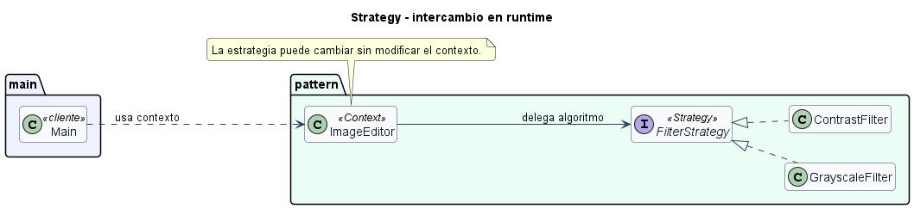

# Strategy intercambiable en runtime

## Patron aplicado

Strategy.

## Variante

Estrategia modificable durante la ejecucion.

## Problematica

Un editor de imagen permite cambiar el filtro activo mientras el usuario trabaja. Si el editor tuviera condicionales por filtro, cada nuevo filtro obligaria a modificarlo.

## Como la atiende el patron

El contexto `ImageEditor` conserva una referencia a `FilterStrategy` y permite reemplazarla con `setFilter()` en tiempo de ejecucion.

## Organizacion del proyecto

- `src/main/Main.java`: ejecuta el caso de uso.
- `src/pattern/PatternImplementation.java`: contiene el contexto, la interfaz Strategy y las estrategias concretas.

## Ejecutar

```bash
mkdir out
javac -encoding UTF-8 -d out src/pattern/*.java src/main/*.java
java -cp out main.Main
```

## UML de la implementacion


