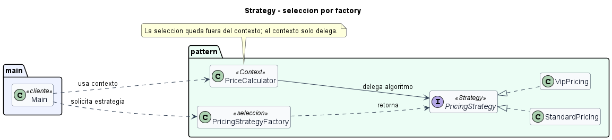

# Strategy seleccionado por factory

## Patron aplicado

Strategy.

## Variante

Estrategia seleccionada por factory/mapa.

## Problematica

Un sistema de pagos debe aplicar reglas distintas segun un codigo externo (`standard`, `vip`, `black_friday`). Colocar esa seleccion dentro del contexto llenaria el calculador de condicionales.

## Como la atiende el patron

Una factory mantiene un mapa entre codigos y estrategias. El contexto recibe la estrategia ya seleccionada y solo delega el calculo.

## Organizacion del proyecto

- `src/main/Main.java`: ejecuta el caso de uso.
- `src/pattern/PatternImplementation.java`: contiene el contexto, la interfaz Strategy y las estrategias concretas.

## Ejecutar

```bash
mkdir out
javac -encoding UTF-8 -d out src/pattern/*.java src/main/*.java
java -cp out main.Main
```

## UML de la implementacion


