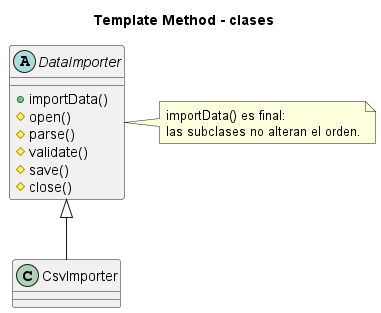
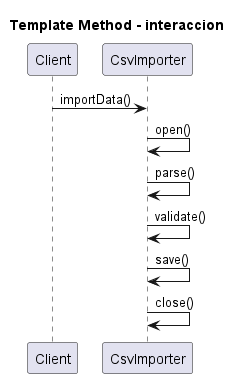

# Template Method

Consulta la [explicación detallada](EXPLICACIÓN.md) para estudiar su propósito, uso, evolución, ventajas y limitaciones.

## Proposito

Definir el esqueleto de un algoritmo en una clase base y permitir que subclases redefinan pasos concretos.

## Problema que resuelve

Varias clases comparten el mismo orden general, pero difieren en algunos pasos. Duplicar el algoritmo dispersa reglas comunes.

## Idea de solucion

La clase abstracta implementa el metodo plantilla y declara operaciones primitivas para los pasos variables.

## Interaccion entre clases

`DataImporter.importData()` ejecuta el orden fijo: abrir, parsear, validar, guardar y cerrar. `CsvImporter` implementa los pasos especificos.

El archivo `UML.puml` y los archivos de `fig/` contienen dos vistas: un diagrama de clases, que muestra la estructura estatica, y un diagrama de secuencia, que muestra el flujo de mensajes entre objetos durante una ejecucion tipica.

## Palabras clave para reconocerlo

- `esqueleto de algoritmo`
- `pasos fijos`
- `hook`
- `subclases redefinen`
- `orden comun`
- `operaciones primitivas`

## Implementacion Java

Cada clase esta separada en un archivo para que la estructura del patron sea visible:

- `src/CsvImporter.java`
- `src/DataImporter.java`
- `src/Main.java`

Para compilar y ejecutar desde esta carpeta:

```bash
javac -encoding UTF-8 src/*.java
java -cp src Main
```

## Tres ejemplos de aplicacion

### Ejemplo 1: Implementacion Generica

**Problematica:** se necesita estudiar la estructura esencial del patron sin ruido accidental de un dominio especifico. **Como la atiende el patron:** muestra la estructura basica para fijar un algoritmo y variar pasos especificos.

### Ejemplo 2: Ciclo de pruebas

**Problematica:** las pruebas comparten preparacion, ejecucion, verificacion y limpieza. **Como la atiende el patron:** la plantilla fija el ciclo y la subclase completa pasos concretos.

### Ejemplo 3: Procesamiento de pedidos

**Problematica:** validar, cobrar, entregar y notificar debe ocurrir en orden. **Como la atiende el patron:** la plantilla conserva la secuencia obligatoria.

## Otras situaciones donde puede usarse

- Procesos con orden obligatorio.
- Importadores con parsing variable.
- Frameworks con hooks.


## Diagramas UML

### Diagrama de clases



### Diagrama de secuencia


