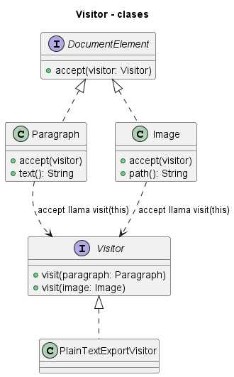
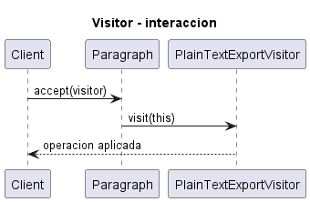
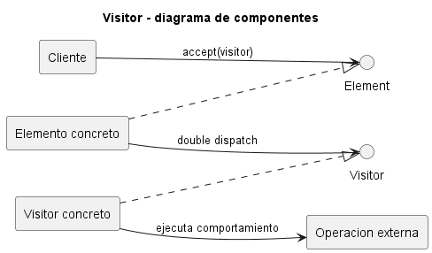

# Explicación Detallada - Visitor

## Para qué sirve

Visitor permite agregar operaciones sobre una estructura estable de tipos sin modificar cada clase cada vez que aparece una operación nueva. Cada elemento acepta un visitante, y el visitante implementa una operación específica para cada tipo concreto.

Su principal ventaja aparece cuando **los tipos de elementos cambian poco** y **las operaciones cambian con frecuencia**. Si ocurre lo contrario, el costo se invierte.

## Cómo se usa

Participan:

- **Element**: declara `accept(Visitor)`.
- **ConcreteElement**: llama al método del visitante correspondiente a su tipo.
- **Visitor**: declara una operación por tipo de elemento.
- **ConcreteVisitor**: implementa una operación transversal.
- **ObjectStructure**: recorre o contiene los elementos.

El mecanismo clave es el **doble despacho**:

1. El cliente llama `element.accept(visitor)`.
2. La implementación concreta de `accept` ejecuta `visitor.visit(this)`.
3. Se selecciona el método según el tipo del visitante y del elemento.

En Java, la sobrecarga se resuelve estáticamente; `accept` hace visible el tipo concreto necesario para la segunda selección.

## Por qué se usa

Concentra una operación transversal en una clase y evita llenar los elementos con comportamiento ajeno. También permite acumular estado durante un recorrido, por ejemplo para generar código, calcular métricas o auditar una estructura.

## Contextos de aplicación

Es frecuente en árboles sintácticos, compiladores, modelos de documentos, jerarquías de figuras y auditorías sobre conjuntos heterogéneos.

No conviene cuando aparecen nuevos tipos de elementos con frecuencia: cada tipo obliga a ampliar la interfaz `Visitor` y todas sus implementaciones. Tampoco es ideal si necesita romper encapsulación para acceder a detalles internos.

## Ventajas y desventajas

### Ventajas

- Agrega operaciones sin modificar elementos estables.
- Agrupa lógica transversal por operación.
- Admite acumulación de estado durante recorridos.
- Hace explícitos todos los tipos soportados.

### Desventajas

- Agregar un nuevo tipo de elemento es costoso.
- Puede exponer información interna.
- El doble despacho resulta menos inmediato.
- Visitantes con métodos vacíos pueden indicar una jerarquía mal segmentada.

## Origen y evolución

Visitor fue formalizado por GoF en 1994, con antecedentes en procesamiento de estructuras y compiladores. El patrón compensa una limitación de lenguajes con despacho simple.

La evolución de pattern matching, tipos algebraicos y expresiones `switch` exhaustivas ofrece alternativas. Cuando el conjunto de variantes está cerrado, estas características pueden expresar operaciones con menos infraestructura. En jerarquías abiertas o bibliotecas orientadas a objetos, Visitor conserva utilidad.

## Estado actual

Visitor sigue siendo relevante en compiladores y modelos estables. En Java moderno debe compararse con `sealed` classes y pattern matching. La elección depende del eje de evolución: Visitor favorece nuevas operaciones; una jerarquía con métodos polimórficos favorece nuevos tipos que encapsulan su comportamiento.

## Patrones relacionados

- **Composite** suele proporcionar la estructura recorrida.
- **Iterator** controla el recorrido sin definir la operación.
- **Interpreter** puede operar sobre árboles sintácticos.
- **Strategy** intercambia un algoritmo uniforme, mientras Visitor distingue tipos concretos.

## Diagramas

Los siguientes diagramas complementan la explicación conceptual. Se muestran directamente aquí para comparar estructura estática, flujo de interacción y organización de componentes.

### Diagrama de clases

El diagrama de clases muestra las abstracciones principales, sus relaciones y la dirección de dependencia estática. El DSL PlantUML está en [fig/ClassDiagram.md](fig/ClassDiagram.md).

### Diagrama de secuencia

El diagrama de secuencia muestra una ejecución típica del patrón de diseño, enfatizando el orden de mensajes entre participantes. El DSL PlantUML está en [fig/SequenceDiagrama.md](fig/SequenceDiagrama.md).

### Diagrama de componentes

El diagrama de componentes resume la colaboración estructural de mayor nivel. El DSL PlantUML está en [fig/ComponentDiagram.md](fig/ComponentDiagram.md).

## Material de esta carpeta

El [README](README.md) y los ejemplos de árbol sintáctico y auditoría muestran el doble despacho. Se recomienda seguir una llamada completa desde `accept` hasta el método `visit` seleccionado.

## Referencia principal

Gamma, E., Helm, R., Johnson, R. y Vlissides, J. (1994). *Design Patterns: Elements of Reusable Object-Oriented Software*. Addison-Wesley.
