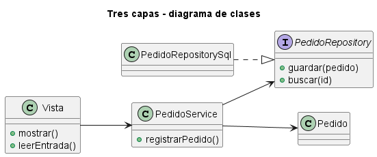
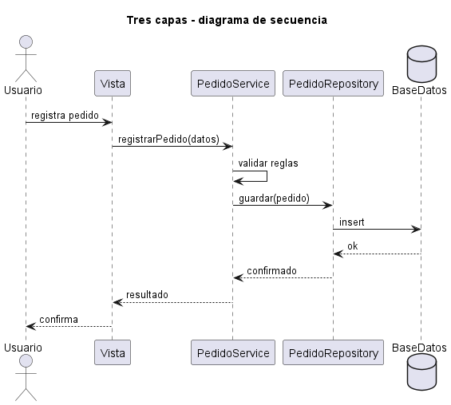
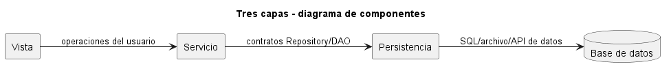

# Explicación Detallada - Arquitectura de Tres Capas

## Para qué sirve

La arquitectura de tres capas separa **vista**, **servicio** y **persistencia**. Es apropiada cuando la aplicación necesita distinguir interacción, coordinación de reglas y almacenamiento.

Cada capa debe tener una responsabilidad verificable:

- **Vista**: captura y presenta información.
- **Servicio**: ejecuta casos de uso, validaciones y coordinación.
- **Persistencia**: recupera y almacena datos.

## Cómo se usa

El flujo normal es descendente para la solicitud y ascendente para el resultado:

```text
vista -> servicio -> persistencia
vista <- servicio <- persistencia
```

La vista no consulta directamente al repositorio. Persistencia no conoce componentes visuales. El servicio no debería depender de detalles de widgets ni de SQL si existen contratos adecuados.

Los DTO pueden proteger los límites, pero no son obligatorios en todo método. Se justifican cuando los modelos de presentación, dominio y almacenamiento cambian por razones diferentes.

## Nomenclatura aplicada

Una implementación Java habitual puede usar:

```text
PedidoController
    -> PedidoService
        -> PedidoRepository
            <- JpaPedidoRepository
```

En un diseño más cercano a tablas o CRUD, la última colaboración puede llamarse `PedidoDao`. La elección comunica el nivel de abstracción:

- `PedidoDao` conoce consultas, filas y operaciones técnicas.
- `PedidoRepository` ofrece operaciones expresadas mediante conceptos del dominio.

Si se necesitan ambos, el repositorio concreto puede delegar en el DAO y usar un `PedidoMapper`. Si ambos exponen exactamente los mismos métodos y solo se reenvían llamadas, una de las abstracciones sobra.

La vista o un `Controller` puede recibir un `PedidoRequestDto`, el servicio trabajar con objetos del dominio y un `Mapper` producir un `PedidoResponseDto`. Esta separación es útil cuando los modelos cambian de forma independiente; no debe aplicarse mecánicamente a toda clase.

## Por qué y cuándo se usa

Se usa en sistemas administrativos, API y aplicaciones empresariales con casos de uso y almacenamiento. Hace visible dónde colocar una regla y facilita pruebas del servicio con persistencia sustituida.

No conviene si el dominio es tan pequeño que las capas solo reenvían llamadas. Tampoco basta para proteger un dominio complejo si el servicio y la persistencia quedan acoplados a tecnologías concretas.

## Ventajas

- Responsabilidades fáciles de comunicar.
- Sustitución y prueba de persistencia mediante contratos.
- Vista independiente del mecanismo de datos.
- Lugar explícito para casos de uso y transacciones.

## Desventajas

- Riesgo de servicios con demasiadas responsabilidades.
- Entidades anémicas si toda regla vive en la capa de servicio.
- Mapeos y delegación adicionales.
- Cambios de una característica atraviesan las tres capas.

## Origen y evolución

La variante se popularizó con sistemas cliente-servidor y aplicaciones empresariales, distinguiendo presentación, lógica de negocio y datos. Su despliegue físico originó el término “three-tier”, aunque una arquitectura lógica de tres capas puede ejecutarse en un solo proceso.

La evolución incorporó dominio rico, repositorios, inversión de dependencias y organización por módulos. En lugar de tres carpetas globales, un sistema puede agrupar cada capacidad y mantener las tres responsabilidades dentro de ella.

## Estado actual

Tres capas sigue siendo un punto de partida válido. Se considera saludable cuando cada capa aísla un cambio real y las reglas importantes poseen pruebas. Si el sistema requiere independencia fuerte de infraestructura, puede evolucionar hacia arquitectura hexagonal sin descartar toda su separación conceptual.

## Ejemplo de esta carpeta

El [README](README.md) y `src/Main.java` presentan las tres responsabilidades en un caso mínimo. La prueba conceptual consiste en reemplazar la persistencia o la vista sin reescribir el servicio.

## Relación con otras variantes

La [explicación general de capas](../EXPLICACIÓN.md) describe reglas de dependencia. La variante de [N capas](<../N capas - Lineal/EXPLICACIÓN.md>) generaliza la descomposición cuando aparecen más responsabilidades.


## Diagramas

Los siguientes diagramas complementan la explicación conceptual. Se muestran directamente aquí para comparar estructura estática, flujo de interacción y organización de componentes.

### Diagrama de clases

El diagrama de clases muestra las abstracciones principales, sus relaciones y la dirección de dependencia estática. El DSL PlantUML está en [fig/ClassDiagram.md](fig/ClassDiagram.md).



### Diagrama de secuencia

El diagrama de secuencia muestra una ejecución típica de la arquitectura, enfatizando el orden de mensajes entre participantes. El DSL PlantUML está en [fig/SequenceDiagrama.md](fig/SequenceDiagrama.md).



### Diagrama de componentes

El diagrama de componentes resume la colaboración estructural de mayor nivel. El DSL PlantUML está en [fig/ComponentDiagram.md](fig/ComponentDiagram.md).


