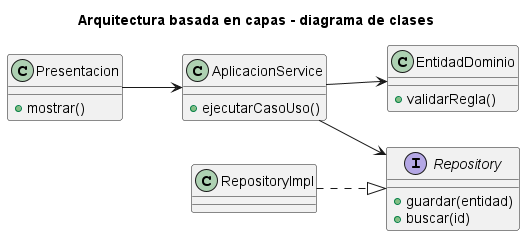
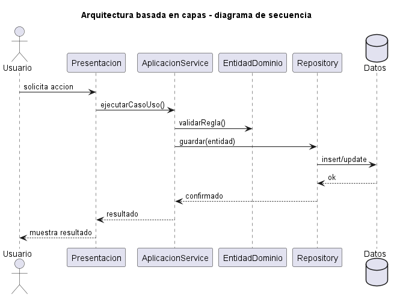
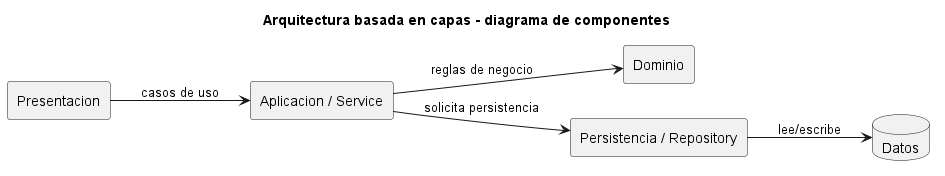

# Explicación Detallada - Arquitectura Basada en Capas

## Para qué sirve

La arquitectura basada en capas organiza el sistema en grupos de responsabilidades situados en niveles. Cada capa ofrece servicios a la capa superior y delega trabajo en la inferior. Su propósito es separar cambios de presentación, reglas de aplicación y mecanismos técnicos.

“Capa” es una separación lógica. No equivale necesariamente a una máquina, proceso o contenedor desplegable; eso corresponde a un **tier** o nivel físico. Una aplicación puede tener varias capas dentro de un único proceso.

## Cómo se usa

Una división frecuente contiene:

- **Presentación**: entrada, salida y adaptación de la interacción.
- **Aplicación o servicio**: coordinación de casos de uso y transacciones.
- **Dominio**: reglas e invariantes del problema.
- **Persistencia o infraestructura**: base de datos, archivos, red y proveedores.

Las dependencias deben seguir una regla conocida. En una versión estricta, cada capa solo conoce la inmediatamente inferior. En una versión relajada, puede saltar capas. La variante relajada reduce delegación, pero aumenta acoplamiento y facilita que las capas intermedias pierdan sentido.

Para aplicarla:

1. Identificar responsabilidades y motivos de cambio.
2. Definir contratos entre capas.
3. Establecer la dirección permitida de dependencias.
4. Mantener modelos o traducciones cuando los límites lo requieran.
5. Proteger la regla con revisión, módulos o pruebas de arquitectura.

## Nomenclaturas comunes

Los sufijos no crean una arquitectura por sí solos. Sirven para comunicar la responsabilidad esperada de una clase. Una clase llamada `UsuarioService` que contiene SQL, construye ventanas y envía respuestas HTTP sigue mezclando capas.

| Sufijo o nombre | Capa habitual | Responsabilidad |
| --- | --- | --- |
| `Controller` | Presentación o entrada | Recibir una acción, validar su forma, invocar un caso de uso y adaptar la respuesta. |
| `View` | Presentación | Mostrar información y capturar interacción sin contener reglas de negocio. |
| `Service` | Aplicación o dominio | Coordinar un caso de uso o expresar una operación de dominio que no pertenece naturalmente a una entidad. |
| `DAO` | Persistencia | Encapsular operaciones técnicas sobre una fuente de datos, normalmente cercanas a tablas, consultas y CRUD. |
| `Repository` | Dominio o frontera con persistencia | Representar una colección de objetos del dominio mediante operaciones expresadas en lenguaje del negocio. |
| `Entity` | Dominio o persistencia | Representar una entidad con identidad; en JPA también puede significar una clase mapeada a persistencia. |
| `DTO` | Límite entre capas | Transportar datos sin exponer directamente el modelo interno. |
| `Mapper` | Límite entre modelos | Convertir entre DTO, entidad de dominio, fila persistente u otro modelo. |
| `Gateway` | Infraestructura | Encapsular acceso a un sistema externo o proveedor. |
| `Client` | Infraestructura | Implementar el protocolo concreto para consumir una API o servicio remoto. |
| `Config` | Composición o infraestructura | Configurar dependencias, framework y recursos técnicos. |

Estas denominaciones son convenciones, no palabras reservadas. Deben ajustarse al vocabulario del proyecto y mantenerse consistentes.

### `Service`

`Service` es un nombre amplio. Conviene distinguir:

- **Application Service**: coordina un caso de uso, controla transacción y delega reglas a entidades o servicios de dominio. Ejemplo: `RegistrarPedidoService`.
- **Domain Service**: contiene una regla de dominio que necesita varias entidades y no pertenece con claridad a una sola. Ejemplo: `CalculadorDeTarifa`.
- **Infrastructure Service**: implementa una capacidad técnica, como correo o almacenamiento. Es preferible un nombre específico, por ejemplo `SmtpNotificador`, en vez de `EmailService`.

Un servicio no debería transformarse en el lugar donde se deposita toda la lógica. Si una regla protege el estado de una entidad, normalmente debe permanecer cerca de esa entidad.

### `DAO` y `Repository`

Aunque ambos acceden a datos, representan niveles de abstracción distintos:

- Un **DAO** suele hablar en términos de persistencia: insertar una fila, ejecutar una consulta, actualizar una tabla o mapear un registro.
- Un **Repository** habla en términos del dominio: guardar un pedido, buscar una cuenta por correo o recuperar reservas activas.

Ejemplos:

```java
interface PedidoRepository {
    Optional<Pedido> buscarPorId(PedidoId id);
    void guardar(Pedido pedido);
}
```

```java
final class PedidoDao {
    PedidoRow selectById(long id) { /* consulta SQL */ }
    void insert(PedidoRow row) { /* inserción SQL */ }
}
```

Un adaptador concreto puede implementar `PedidoRepository` usando `PedidoDao` y un `PedidoMapper`:

```text
Application Service
        -> PedidoRepository
                 <- SqlPedidoRepository
                         -> PedidoDao
                         -> PedidoMapper
```

No siempre se necesitan ambos. En un CRUD sencillo, `DAO` puede ser suficiente. En un dominio rico, `Repository` protege mejor el vocabulario del negocio. Crear `Service -> Repository -> DAO` cuando las dos últimas clases solo reenvían la misma llamada agrega capas sin responsabilidad.

### `DTO`, `Entity` y `Mapper`

Un `DTO` representa datos para un límite concreto, por ejemplo una solicitud HTTP o una respuesta de API. No debería adquirir reglas de negocio.

El término `Entity` es ambiguo:

- **Entidad de dominio**: posee identidad y comportamiento significativo.
- **Entidad de persistencia**: clase anotada o estructurada para el ORM.

Ambas pueden ser la misma clase en sistemas simples. Separarlas es útil cuando el modelo de base de datos y el modelo de dominio evolucionan por razones distintas. En ese caso, un `Mapper` realiza la conversión de manera explícita.

## Flujos de dependencia habituales

### Capas clásicas

```text
UsuarioController
    -> UsuarioService
        -> UsuarioDao
            -> Base de datos
```

Esta variante es directa y apropiada para aplicaciones CRUD donde el modelo de datos domina el diseño.

### Capas con repositorio de dominio

```text
UsuarioController
    -> RegistrarUsuarioService
        -> UsuarioRepository
            <- JpaUsuarioRepository
                -> EntityManager
```

La flecha invertida indica que la aplicación conoce el contrato y la infraestructura aporta la implementación. Esta organización combina capas con inversión de dependencias.

### Integración externa

```text
PedidoService
    -> PagoGateway
        <- StripePagoClient
```

El caso de uso depende de una capacidad abstracta; el cliente concreto conoce HTTP, credenciales y formatos del proveedor.

## Convenciones de paquetes

Una organización técnica frecuente es:

```text
controller/
service/
domain/
repository/
dao/
dto/
mapper/
config/
```

Es comprensible en proyectos pequeños. Cuando el sistema crece, una organización por capacidad reduce cambios dispersos:

```text
pedidos/
    controller/
    application/
    domain/
    infrastructure/
usuarios/
    controller/
    application/
    domain/
    infrastructure/
```

La segunda forma conserva capas dentro de cada módulo y evita directorios globales con cientos de clases no relacionadas.

## Errores frecuentes de nomenclatura

- Llamar `Service` a una clase que solo delega en otra sin agregar coordinación, reglas ni transacción.
- Usar `Repository` como sinónimo de cualquier clase con SQL.
- Crear un `DAO` y un `Repository` idénticos por obligación.
- Retornar entidades JPA directamente desde `Controller` y acoplar la API al esquema de persistencia.
- Colocar reglas del negocio en `Controller`, `DAO` o `Mapper`.
- Nombrar clases como `Manager`, `Helper` o `Util` sin una responsabilidad precisa.
- Agregar prefijos como `IUsuarioRepository` en Java cuando `UsuarioRepository` ya expresa adecuadamente una interfaz.

## Por qué se usa

La separación permite modificar una interfaz o mecanismo de persistencia sin reescribir todas las reglas. También distribuye el trabajo entre equipos y ofrece una estructura reconocible.

No basta con crear paquetes llamados `vista`, `servicio` y `datos`. La arquitectura existe solo si las responsabilidades y dependencias respetan esos límites.

## Contextos de aplicación

Es apropiada para sistemas de información, aplicaciones empresariales, API con reglas de negocio y proyectos educativos donde se necesita hacer visible la separación de responsabilidades.

Es menos adecuada para transformaciones lineales de datos, dominios muy pequeños o sistemas que requieren independencia fuerte del núcleo frente a la infraestructura; en este último caso pueden emplearse dependencias invertidas, arquitectura hexagonal o limpia.

## Ventajas y desventajas

### Ventajas

- Estructura familiar y fácil de comunicar.
- Separa responsabilidades y tecnologías.
- Permite reemplazos locales cuando los contratos son estables.
- Facilita pruebas por nivel.
- Puede adoptarse gradualmente.

### Desventajas

- Incentiva modelos anémicos si toda la lógica queda en servicios.
- Puede generar llamadas de delegación sin valor.
- Los cambios verticales atraviesan varias capas.
- Una dependencia descendente hacia infraestructura acopla el dominio.
- Las capas pueden convertirse en carpetas nominales sin aislamiento real.

## Origen y evolución

La organización jerárquica de software tiene antecedentes en sistemas operativos. La descripción del sistema THE de Edsger Dijkstra, publicada en 1968, mostró una construcción por niveles verificables. Las ideas de modularidad e información oculta de David Parnas reforzaron posteriormente la separación por decisiones de diseño.

Durante las décadas de 1980 y 1990, las aplicaciones cliente-servidor y empresariales popularizaron las arquitecturas de dos y tres niveles. La literatura de patrones arquitecturales consolidó variantes con presentación, negocio y acceso a datos.

La evolución posterior introdujo inversión de dependencias: dominio y aplicación definen contratos que implementa la infraestructura. Arquitecturas hexagonal, de cebolla y limpia conservan separación por responsabilidades, pero rechazan que el núcleo dependa de detalles externos.

## Estado actual

La arquitectura por capas continúa siendo una opción razonable para muchos sistemas. Su uso actual tiende a combinarse con módulos por característica o dominio, evitando una única capa global para toda la aplicación. En un monolito modular, cada módulo puede contener sus propias capas.

La pregunta relevante no es cuántas capas existen, sino qué cambio aísla cada una y si la dirección de dependencias protege las reglas importantes.

## Variantes de esta carpeta

- [Dos capas: frontend y backend](<2 capas - Frontend Backend/EXPLICACIÓN.md>).
- [Tres capas: vista, servicio y persistencia](<3 capas - Vista Servicio Persistencia/EXPLICACIÓN.md>).
- [N capas con relación lineal](<N capas - Lineal/EXPLICACIÓN.md>).

El [README](README.md) resume la ejecución de los ejemplos.


## Diagramas

Los siguientes diagramas complementan la explicación conceptual. Se muestran directamente aquí para comparar estructura estática, flujo de interacción y organización de componentes.

### Diagrama de clases

El diagrama de clases muestra las abstracciones principales, sus relaciones y la dirección de dependencia estática. El DSL PlantUML está en [fig/ClassDiagram.md](fig/ClassDiagram.md).



### Diagrama de secuencia

El diagrama de secuencia muestra una ejecución típica de la arquitectura, enfatizando el orden de mensajes entre participantes. El DSL PlantUML está en [fig/SequenceDiagrama.md](fig/SequenceDiagrama.md).



### Diagrama de componentes

El diagrama de componentes resume la colaboración estructural de mayor nivel. El DSL PlantUML está en [fig/ComponentDiagram.md](fig/ComponentDiagram.md).



## Referencias

- Dijkstra, E. W. (1968). *The Structure of the “THE” Multiprogramming System*.
- Buschmann, F. et al. (1996). *Pattern-Oriented Software Architecture, Volume 1*.
