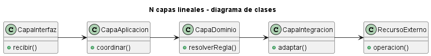
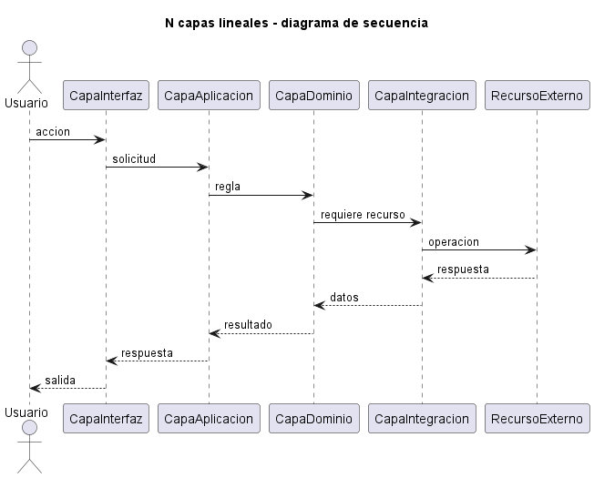
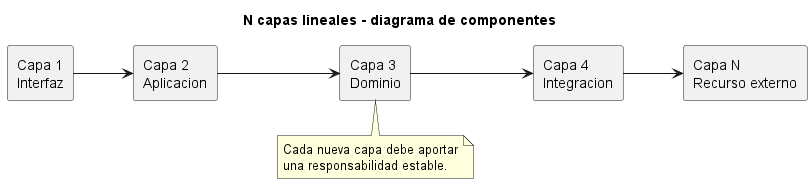

# Explicación Detallada - Arquitectura de N Capas Lineales

## Para qué sirve

La arquitectura de N capas generaliza la separación en una secuencia de componentes, donde cada uno se relaciona linealmente con el siguiente. Se utiliza cuando dos o tres responsabilidades no bastan para aislar motivos de cambio relevantes.

La letra N no recomienda crear muchas capas. Indica que la cantidad deriva del problema.

## Cómo se usa

Un ejemplo posible es:

```text
presentación -> aplicación -> dominio -> persistencia -> fuente externa
```

Cada capa:

- Posee una responsabilidad cohesionada.
- Expone un contrato a su vecina.
- No conoce detalles de capas superiores.
- Traduce modelos solo cuando el límite semántico lo requiere.

En una arquitectura estricta, una capa solo llama a la siguiente. Esto permite sustituir y observar cada tramo, pero puede generar delegación. Una variante relajada admite saltos controlados y sacrifica parte del aislamiento.

La relación lineal no impide que una capa tenga varios componentes internos. Tampoco exige una clase por capa.

## Por qué y cuándo se usa

Se usa cuando existen transformaciones, políticas o integraciones con ciclos de cambio distintos: seguridad, aplicación, dominio, persistencia, mensajería o legado. Cada capa debe justificar qué dependencia contiene.

No conviene agregar una capa solo para “ordenar” paquetes. Si una capa no transforma, protege ni coordina nada, probablemente es accidental.

## Ventajas

- Permite aislar más decisiones.
- Hace explícito el recorrido de una solicitud.
- Facilita reemplazos y pruebas por contrato.
- Puede proteger tecnologías heredadas mediante capas de traducción.

## Desventajas

- Mayor latencia conceptual y, a veces, computacional.
- Muchos mapeos y objetos intermedios.
- Cambios verticales atraviesan varios contratos.
- Riesgo de capas pasivas que solo delegan.
- La linealidad puede ser artificial para dominios modulares.

## Origen y evolución

N capas extiende las arquitecturas jerárquicas y empresariales. A medida que los sistemas incorporaron servicios de aplicación, dominio e infraestructura, la clásica división en tres se refinó.

La evolución moderna combina capas con módulos por capacidad. En vez de una línea global para todo el sistema, cada módulo puede contener una secuencia breve y publicar una API estable. Arquitecturas con inversión de dependencias también conservan niveles conceptuales, aunque la dirección del código fuente apunta hacia el núcleo.

## Estado actual

La variante sigue siendo útil como modelo de razonamiento, no como objetivo de cantidad. Una arquitectura sana minimiza el número de límites necesarios y verifica sus dependencias. Si dos capas siempre cambian juntas y no pueden probarse o sustituirse por separado, su separación debe cuestionarse.

## Ejemplo de esta carpeta

El [README](README.md) y `src/Main.java` muestran una cadena lineal. Para analizarla, identifique el dato de entrada, la transformación de cada componente y el contrato entregado al siguiente.

## Relación con otras variantes

La [explicación general de capas](../EXPLICACIÓN.md) ofrece el contexto histórico y conceptual. Las variantes de [dos capas](<../2 capas - Frontend Backend/EXPLICACIÓN.md>) y [tres capas](<../3 capas - Vista Servicio Persistencia/EXPLICACIÓN.md>) son casos concretos de esta generalización.


## Diagramas

Los siguientes diagramas complementan la explicación conceptual. Se muestran directamente aquí para comparar estructura estática, flujo de interacción y organización de componentes.

### Diagrama de clases

El diagrama de clases muestra las abstracciones principales, sus relaciones y la dirección de dependencia estática. El DSL PlantUML está en [fig/ClassDiagram.md](fig/ClassDiagram.md).



### Diagrama de secuencia

El diagrama de secuencia muestra una ejecución típica de la arquitectura, enfatizando el orden de mensajes entre participantes. El DSL PlantUML está en [fig/SequenceDiagrama.md](fig/SequenceDiagrama.md).



### Diagrama de componentes

El diagrama de componentes resume la colaboración estructural de mayor nivel. El DSL PlantUML está en [fig/ComponentDiagram.md](fig/ComponentDiagram.md).


