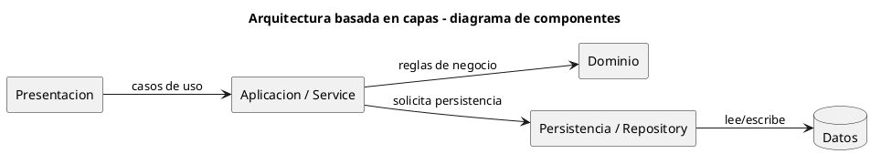

# Diagrama de componentes - Arquitectura basada en capas

Este archivo conserva el DSL PlantUML utilizado para generar `ComponentDiagram.png`. La imagen se referencia desde `EXPLICACIÓN.md` para que el material pueda estudiarse sin abrir herramientas externas.

