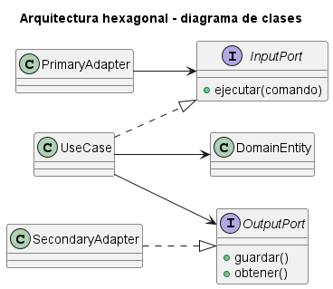
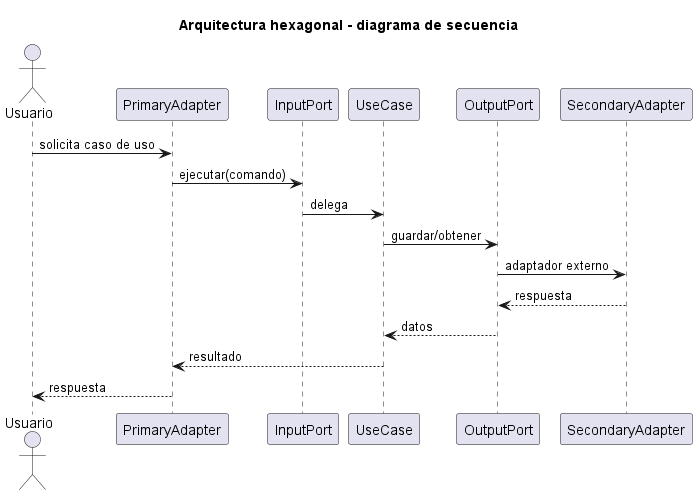
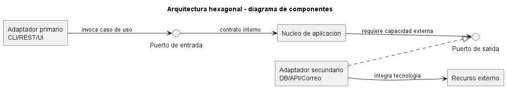

# Explicación Detallada - Arquitectura Hexagonal

## Para qué sirve

La arquitectura hexagonal, también llamada **Ports and Adapters**, protege la lógica de aplicación frente a tecnologías externas. El núcleo define contratos y casos de uso; adaptadores concretos conectan interfaces de usuario, bases de datos, mensajes y servicios.

El hexágono no prescribe seis lados ni seis componentes. Es una representación visual que evita privilegiar una tecnología externa sobre otra.

## Cómo se usa

Los elementos principales son:

- **Aplicación o núcleo**: reglas y casos de uso.
- **Puertos de entrada**: operaciones que la aplicación ofrece a actores externos.
- **Adaptadores de entrada**: CLI, controlador web, GUI o consumidor de mensajes.
- **Puertos de salida**: necesidades que el núcleo expresa, como persistir o notificar.
- **Adaptadores de salida**: repositorios SQL, archivos, API o productores de eventos.

La dirección de dependencia apunta hacia el núcleo. Un puerto de salida pertenece conceptualmente a la aplicación, aunque su implementación esté en infraestructura.

El flujo de entrada es:

```text
actor -> adaptador de entrada -> puerto de entrada -> caso de uso
```

El flujo de salida es:

```text
caso de uso -> puerto de salida -> adaptador de salida -> tecnología
```

La composición en el arranque conecta implementaciones con puertos. Las pruebas pueden usar adaptadores en memoria.

## Por qué se usa

Permite ejecutar y probar la aplicación sin interfaz o base de datos real. También evita que conceptos técnicos contaminen el modelo y hace explícitas las dependencias externas.

## Contextos de aplicación

Es apropiada en dominios con reglas relevantes, múltiples canales de entrada, integraciones cambiantes y necesidad de pruebas rápidas. Funciona tanto en monolitos como dentro de un microservicio.

Puede ser excesiva para CRUD mínimo o scripts. Crear una interfaz para cada clase sin un límite externo real produce abstracción accidental.

## Ventajas y desventajas

### Ventajas

- Aísla reglas respecto de frameworks e infraestructura.
- Facilita pruebas mediante adaptadores sustitutos.
- Permite múltiples entradas y salidas.
- Hace visible la inversión de dependencias.
- Reduce dependencia tecnológica del núcleo.

### Desventajas

- Introduce contratos, mapeos y composición.
- Puede duplicar modelos en límites.
- Requiere disciplina para impedir imports hacia infraestructura.
- Una aplicación sin lógica suficiente puede quedar sobrediseñada.
- El nombre de cada capa varía entre autores.

## Origen y evolución

Alistair Cockburn publicó la formulación original en 2005. Su intención era que una aplicación pudiera funcionar sin interfaz ni base de datos, ser probada en aislamiento y conectarse a distintos dispositivos o sistemas.

Arquitectura de cebolla y Clean Architecture desarrollaron ideas cercanas con representaciones concéntricas y reglas de dependencia. Aunque difieren en vocabulario y granularidad, comparten la protección del núcleo y la inversión de dependencias hacia contratos internos.

## Estado actual

Ports and Adapters continúa ampliamente utilizado. Su aplicación moderna tiende a organizar puertos por capacidad o caso de uso y adaptadores por tecnología. El valor no está en crear muchas carpetas, sino en poder sustituir un borde sin modificar reglas centrales.


## Diagramas

Los siguientes diagramas complementan la explicación conceptual. Se muestran directamente aquí para comparar estructura estática, flujo de interacción y organización de componentes.

### Diagrama de clases

El diagrama de clases muestra las abstracciones principales, sus relaciones y la dirección de dependencia estática. El DSL PlantUML está en [fig/ClassDiagram.md](fig/ClassDiagram.md).



### Diagrama de secuencia

El diagrama de secuencia muestra una ejecución típica de la arquitectura, enfatizando el orden de mensajes entre participantes. El DSL PlantUML está en [fig/SequenceDiagrama.md](fig/SequenceDiagrama.md).



### Diagrama de componentes

El diagrama de componentes resume la colaboración estructural de mayor nivel. El DSL PlantUML está en [fig/ComponentDiagram.md](fig/ComponentDiagram.md).



## Material de esta carpeta

El [README](README.md) y `src/Main.java` muestran un puerto de persistencia y un adaptador en memoria. Para comprobar el patrón, debería ser posible reemplazar ese adaptador sin cambiar el caso de uso.

## Referencias

- [Hexagonal Architecture, artículo original de Alistair Cockburn (2005)](https://alistair.cockburn.us/hexagonal-architecture/).
- [Hexagonal Architecture Pattern, AWS Prescriptive Guidance](https://docs.aws.amazon.com/prescriptive-guidance/latest/cloud-design-patterns/hexagonal-architecture.html).
