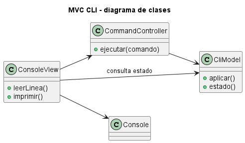
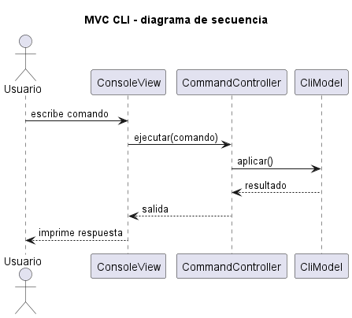
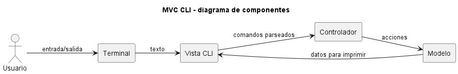

# Explicación Detallada - MVC para Interfaz de Línea de Comandos

## Para qué sirve

MVC CLI aplica la separación Modelo-Vista-Controlador a una interfaz de texto. Demuestra que MVC no depende de ventanas gráficas: la vista puede leer y escribir texto, mientras modelo y controlador permanecen independientes de `Scanner` y `System.out`.

## Cómo se usa

La vista:

- Presenta menús y resultados.
- Lee texto.
- Convierte errores de interacción en mensajes comprensibles.

El controlador:

- Interpreta la opción seleccionada.
- Solicita operaciones al modelo.
- Decide qué resultado debe presentar la vista.

El modelo:

- Conserva estado y reglas.
- No imprime ni lee desde consola.
- Expone operaciones con significado de dominio.

El bucle principal controla inicio, repetición y término. Debe evitarse la recursión para volver a mostrar menús, porque acumula llamadas innecesariamente.

## Por qué y cuándo se usa

Es útil en herramientas administrativas, prototipos, programas educativos y aplicaciones ejecutadas en terminal. Permite probar el modelo sin entrada interactiva y reemplazar la CLI por otra vista.

## Ventajas

- Bajo costo tecnológico.
- Separación clara entre entrada textual y reglas.
- Pruebas automatizadas de controlador y modelo.
- Posibilidad de reutilizar el núcleo en GUI o web.

## Desventajas

- El bucle de interacción puede crecer demasiado.
- Mezclar parseo y reglas en el controlador es una tentación frecuente.
- La validación de entrada posee muchos casos de error.
- Una CLI mínima puede no justificar todos los roles.

## Origen y evolución

Esta variante traslada los principios de MVC desde interfaces gráficas a terminal. Las primeras aplicaciones interactivas ya separaban procesamiento y presentación, aunque no siempre usaban el nombre MVC.

Las CLI modernas agregan subcomandos, opciones declarativas, salida estructurada y códigos de término. En esos casos, el controlador puede mapear comandos a casos de uso y la vista puede ofrecer formatos humano y máquina.

## Estado actual

MVC CLI sigue siendo apropiado para herramientas con flujo interactivo o varios casos de uso. Para comandos pequeños de una sola operación, una arquitectura más directa suele ser suficiente. La separación debe crecer con la complejidad real.

## Ejemplo de esta carpeta

El [README](README.md) y `src/Main.java` contienen una interacción mínima. El criterio esencial es que el modelo pueda ejecutarse sin consola y que la vista no decida reglas del dominio.

## Relación con MVC

La [explicación general de MVC](../EXPLICACIÓN.md) describe los roles y su origen. Esta variante concreta el ciclo en un único hilo y proceso.

## Diagramas

Los siguientes diagramas complementan la explicación conceptual. Se muestran directamente aquí para comparar estructura estática, flujo de interacción y organización de componentes.

### Diagrama de clases

El diagrama de clases muestra las abstracciones principales, sus relaciones y la dirección de dependencia estática. El DSL PlantUML está en [fig/ClassDiagram.md](fig/ClassDiagram.md).

### Diagrama de secuencia

El diagrama de secuencia muestra una ejecución típica de la arquitectura, enfatizando el orden de mensajes entre participantes. El DSL PlantUML está en [fig/SequenceDiagrama.md](fig/SequenceDiagrama.md).

### Diagrama de componentes

El diagrama de componentes resume la colaboración estructural de mayor nivel. El DSL PlantUML está en [fig/ComponentDiagram.md](fig/ComponentDiagram.md).

