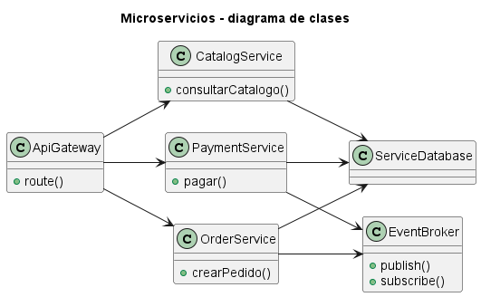
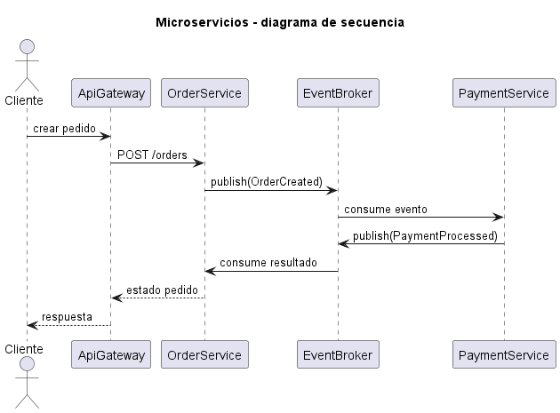
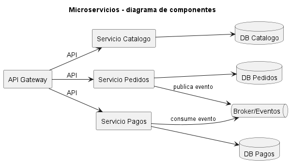

# Explicación Detallada - Arquitectura de Microservicios

## Para qué sirve

La arquitectura de microservicios construye un sistema como un conjunto de servicios autónomos, organizados por capacidades de negocio y desplegables de forma independiente. Su propósito es permitir evolución, despliegue y escalamiento independientes donde los límites organizacionales y del dominio lo justifican.

“Micro” no define un número de líneas ni una tabla por servicio. Un límite útil encierra una capacidad cohesionada, su lógica y normalmente la propiedad de sus datos.

## Cómo se usa

Cada servicio:

- Expone contratos explícitos mediante API o mensajes.
- Controla su lógica y datos.
- Puede construirse y desplegarse sin coordinar una versión única del sistema.
- Se observa, prueba y opera como unidad.

La interacción puede ser sincrónica o asincrónica. Las llamadas remotas deben tratar latencia, timeout, reintentos, circuit breaking e idempotencia. Las operaciones que atraviesan servicios no comparten fácilmente una transacción ACID; suelen usar eventos, sagas y consistencia eventual.

Un proceso de adopción razonable comienza por:

1. Delimitar capacidades y contextos del dominio.
2. Construir módulos internos cohesionados.
3. Extraer solo los límites que necesitan autonomía operacional.
4. Automatizar pruebas, despliegue, métricas, trazas y recuperación.
5. Diseñar contratos evolutivos y propiedad de datos.

## Por qué se usa

Los microservicios endurecen límites que en un monolito pueden violarse mediante llamadas internas. Permiten que equipos autónomos desplieguen y escalen capacidades distintas.

El costo no desaparece: la complejidad se traslada desde llamadas y transacciones locales hacia red, operación, observabilidad y coordinación de datos.

## Contextos de aplicación

Son apropiados para sistemas grandes con capacidades bien delimitadas, equipos independientes, ritmos de despliegue diferentes y madurez operacional alta.

No suelen ser adecuados para equipos pequeños, dominios aún inestables, aplicaciones simples o entornos sin automatización. Un monolito modular puede ofrecer límites claros con mucho menor costo.

## Ventajas y desventajas

### Ventajas

- Despliegue y escalamiento independientes.
- Límites de módulo reforzados por proceso y API.
- Autonomía de equipos.
- Aislamiento parcial de fallos.
- Libertad tecnológica selectiva.

### Desventajas

- Fallos parciales, latencia y entrega de mensajes.
- Consistencia distribuida más compleja.
- Pruebas integrales y depuración más costosas.
- Mayor infraestructura y carga operacional.
- Riesgo de monolito distribuido si los servicios están fuertemente acoplados.
- Evolución de contratos y datos requiere disciplina.

## Origen y evolución

Los microservicios evolucionan desde sistemas distribuidos, arquitectura orientada a servicios y prácticas de entrega continua. El término se consolidó a comienzos de la década de 2010; James Lewis y Martin Fowler describieron en 2014 características observadas como organización por capacidades, despliegue independiente, datos descentralizados, automatización y diseño para fallos.

La adopción masiva impulsó contenedores, orquestación, service mesh y observabilidad distribuida. También evidenció fracasos por fragmentación prematura. Por ello aumentó el interés en monolitos modulares, extracción incremental y límites guiados por dominio.

## Estado actual

Los microservicios son una opción madura, no un destino obligatorio. La tendencia responsable es justificar cada frontera por autonomía, escalamiento o aislamiento reales. El tamaño debe seguir la cohesión del dominio y la capacidad del equipo para operar un sistema distribuido.

## Diagramas

Los siguientes diagramas complementan la explicación conceptual. Se muestran directamente aquí para comparar estructura estática, flujo de interacción y organización de componentes.

### Diagrama de clases

El diagrama de clases muestra las abstracciones principales, sus relaciones y la dirección de dependencia estática. El DSL PlantUML está en [fig/ClassDiagram.md](fig/ClassDiagram.md).

### Diagrama de secuencia

El diagrama de secuencia muestra una ejecución típica de la arquitectura, enfatizando el orden de mensajes entre participantes. El DSL PlantUML está en [fig/SequenceDiagrama.md](fig/SequenceDiagrama.md).

### Diagrama de componentes

El diagrama de componentes resume la colaboración estructural de mayor nivel. El DSL PlantUML está en [fig/ComponentDiagram.md](fig/ComponentDiagram.md).

## Material de esta carpeta

El [README](README.md) y `src/Main.java` modelan dos servicios y una comunicación simplificada. El ejemplo es conceptual: una implementación real requiere transporte, persistencia, seguridad y observabilidad.

## Referencias

- [Microservices, James Lewis y Martin Fowler (2014)](https://martinfowler.com/articles/microservices.html).
- [Microservice Trade-Offs, Martin Fowler](https://martinfowler.com/articles/microservice-trade-offs.html).
