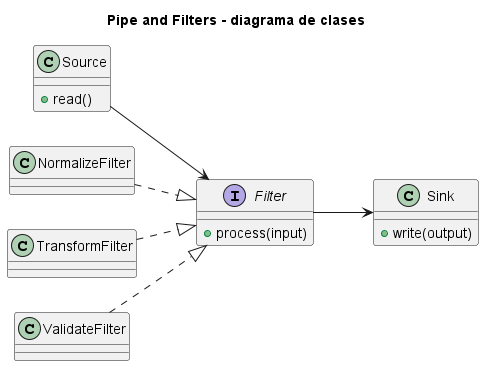
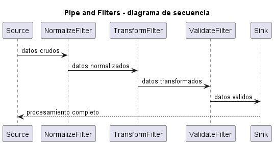
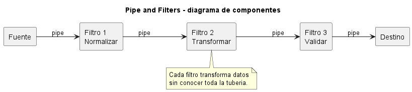

# Explicación Detallada - Pipe and Filters

## Para qué sirve

Pipe and Filters organiza un procesamiento como una secuencia de transformaciones independientes. Cada **filtro** recibe datos, realiza una operación y produce una salida; cada **pipe** transporta el resultado al siguiente filtro.

El estilo sirve para descomponer procesos complejos en etapas pequeñas, combinables y verificables.

## Cómo se usa

Un flujo típico puede expresarse así:

```text
entrada -> normalizar -> validar -> enriquecer -> transformar -> salida
```

Para conservar independencia:

- Cada filtro debe tener un contrato claro de entrada y salida.
- Un filtro no debería conocer la posición de los demás.
- El estado compartido debe evitarse o hacerse explícito.
- Los errores deben viajar por un canal o tipo definido.
- El orden debe documentarse cuando las operaciones no son conmutativas.

Los pipes pueden transportar lotes completos o streams. En procesamiento concurrente, cada filtro puede operar en paralelo, pero entonces aparecen buffering, orden, presión de retorno y cancelación.

## Por qué se usa

La descomposición permite probar, reemplazar y reordenar etapas. También facilita paralelismo y reutilización cuando los contratos son compatibles.

## Contextos de aplicación

Es común en compiladores, ETL, procesamiento multimedia, comandos Unix, validación, análisis de logs y flujos de datos. Resulta apropiado cuando el problema es naturalmente transformacional.

No conviene para lógica altamente interactiva, transacciones con mucho estado compartido o procesos donde cada etapa depende de detalles internos de todas las anteriores.

## Ventajas y desventajas

### Ventajas

- Alta cohesión por etapa.
- Reutilización y composición.
- Pruebas unitarias simples para filtros puros.
- Posibilidad de paralelismo y streaming.
- Visibilidad del flujo de transformación.

### Desventajas

- Conversión repetida entre formatos.
- Manejo complejo de errores y resultados parciales.
- El rendimiento depende de buffers y copias.
- La depuración extremo a extremo puede ser difícil.
- El orden de filtros puede crear dependencias implícitas.

## Origen y evolución

La idea tiene antecedentes en cadenas de procesamiento y compiladores. Douglas McIlroy promovió la composición de programas pequeños mediante pipes en Unix, implementados durante la década de 1970. La literatura de arquitectura de software formalizó posteriormente **Pipes and Filters** como estilo.

Su evolución aparece en frameworks ETL, procesamiento de eventos, Reactive Streams y plataformas distribuidas. Los sistemas modernos agregan control de demanda, ventanas, paralelismo, persistencia y tolerancia a fallos.

## Estado actual

El estilo continúa vigente desde scripts hasta procesamiento distribuido. En aplicaciones modernas se debe distinguir una cadena local de funciones de un pipeline distribuido: este último exige semántica de entrega, checkpoints, particionamiento y recuperación.

## Patrones relacionados

- **Chain of Responsibility** pasa una solicitud entre manejadores que pueden detener la cadena.
- **Decorator** envuelve una operación conservando la misma interfaz.
- **Template Method** fija etapas dentro de una jerarquía.
- **Reactive Streams** define un protocolo para flujos asincrónicos con presión de retorno.


## Diagramas

Los siguientes diagramas complementan la explicación conceptual. Se muestran directamente aquí para comparar estructura estática, flujo de interacción y organización de componentes.

### Diagrama de clases

El diagrama de clases muestra las abstracciones principales, sus relaciones y la dirección de dependencia estática. El DSL PlantUML está en [fig/ClassDiagram.md](fig/ClassDiagram.md).



### Diagrama de secuencia

El diagrama de secuencia muestra una ejecución típica de la arquitectura, enfatizando el orden de mensajes entre participantes. El DSL PlantUML está en [fig/SequenceDiagrama.md](fig/SequenceDiagrama.md).



### Diagrama de componentes

El diagrama de componentes resume la colaboración estructural de mayor nivel. El DSL PlantUML está en [fig/ComponentDiagram.md](fig/ComponentDiagram.md).



## Material de esta carpeta

El [README](README.md) y `src/Main.java` muestran una cadena local de transformaciones. Debe verificarse cada filtro por separado y luego el orden completo.

## Referencias

- Buschmann, F. et al. (1996). *Pattern-Oriented Software Architecture, Volume 1*.
- Shaw, M. y Garlan, D. (1996). *Software Architecture: Perspectives on an Emerging Discipline*.
